# Attack Simulation Training reporting

[](https://learn.microsoft.com/defender-office-365/attack-simulation-training-get-started)
[](https://learn.microsoft.com/azure/azure-functions/flex-consumption-plan)
[](powerbi/)
[](https://learn.microsoft.com/graph/api/resources/attacksimulationroot)
[](../LICENSE)

Turn Microsoft Defender for Office 365 **Attack Simulation Training** results into a ten-page Power BI report that shows trends across every campaign, not one campaign at a time.

- **See the whole program.** Susceptibility and reporting rates over time, by department, by technique and by person.
- **Find who needs help.** Repeat offenders, overdue training and the departments that never report.
- **Runs on its own.** A small Azure Function copies new results from Microsoft Graph every hour, for a few dollars a month.

<p align="center"><a href="docs/images/report/04-executive-summary.png">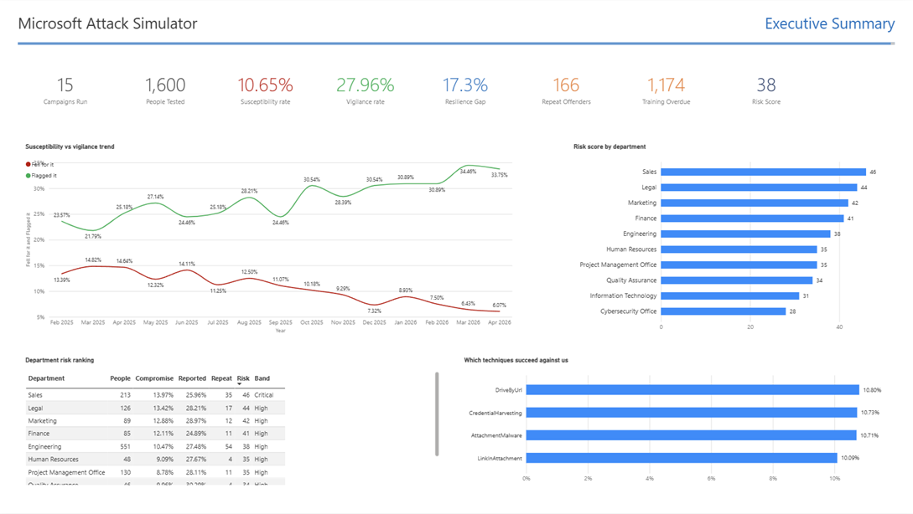</a><br><sub>The <b>Executive Summary</b> page. All report screenshots use a synthetic demo tenant: 1,600 users across 15 campaigns.</sub></p>

<table>
<tr><th width="50%">Build it step by step</th><th width="50%">Download</th></tr>
<tr>
<td valign="top">Create the storage, the app registration and the Function App in the Azure portal, with a screenshot for every step. About 45 minutes. See the <a href="docs/build-in-the-portal.md">guide</a>.</td>
<td valign="top">The ready-to-run code package and the Power BI template from the <a href="https://github.com/Muatazawad2/Email/releases/tag/attacksimulator-v1.0.0">AttackSimulator v1.0.0 release</a>.</td>
</tr>
<tr>
<td align="center"><a href="docs/build-in-the-portal.md"></a></td>
<td align="center"><a href="https://github.com/Muatazawad2/Email/releases/tag/attacksimulator-v1.0.0"></a></td>
</tr>
</table>

> [!IMPORTANT]
> This is a community sample, provided as-is. It isn't a supported Microsoft product. It reads the Microsoft Graph **beta** attack simulation API, which can change. All access to Microsoft 365 is read-only.

## Contents

- [Why](#why)
- [The report](#the-report)
- [How it works](#how-it-works)
- [Build it in the portal](#build-it-in-the-portal)
- [Deploy](#deploy)
- [Power BI report](#power-bi-report)
- [Settings](#settings)
- [Run locally](#run-locally)
- [Credits](#credits)

## Why

The Microsoft Defender portal shows Attack Simulation Training results **one simulation at a time**. There's no built-in way to trend results across campaigns, compare departments, follow people who are compromised again and again, or check training completion against who actually clicked.

This project keeps every result in your own Azure storage and puts a report on top of it.

## The report

Ten pages, 56 measures and row-level security so each employee can see only their own results.

<table>
<tr>
<td width="50%" valign="top"><a href="docs/images/report/01-program-scorecard.png">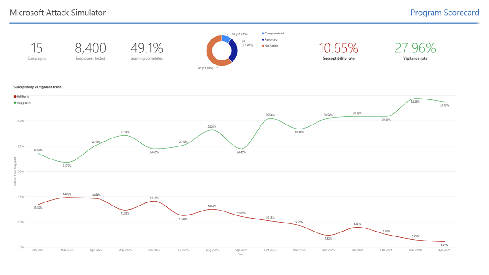</a><br><b>Program Scorecard</b>: headline rates, outcome split and the monthly trend.</td>
<td width="50%" valign="top"><a href="docs/images/report/02-reporting-behaviour.png">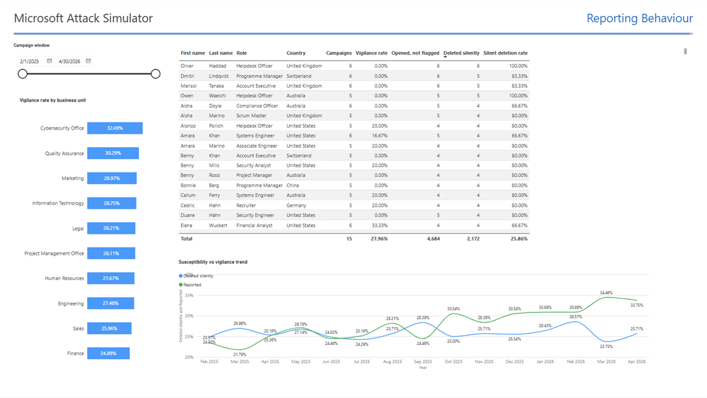</a><br><b>Reporting Behaviour</b>: who reports and who stays silent.</td>
</tr>
<tr>
<td valign="top"><a href="docs/images/report/03-business-unit-breakdown.png">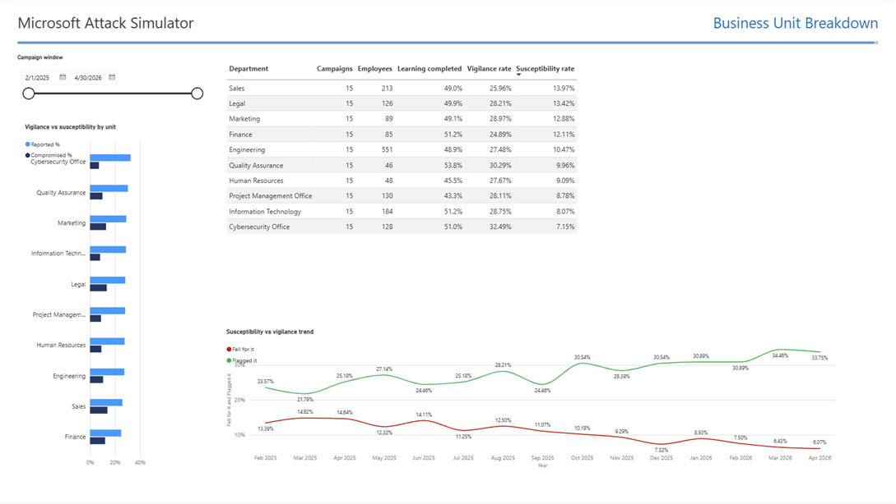</a><br><b>Business Unit Breakdown</b>: the same measures by department.</td>
<td valign="top"><a href="docs/images/report/05-repeat-offenders.png">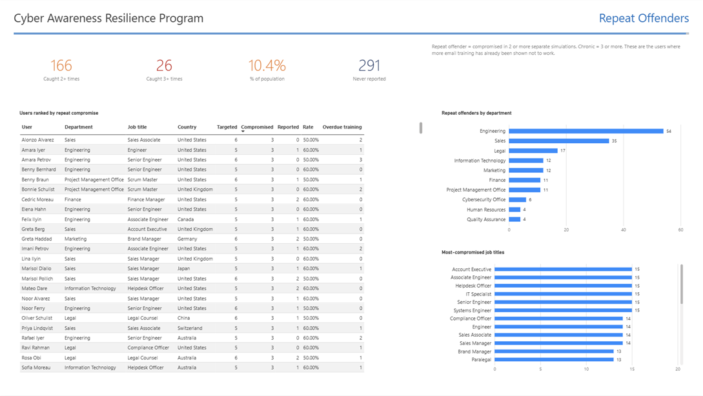</a><br><b>Repeat Offenders</b>: people compromised more than once.</td>
</tr>
<tr>
<td valign="top"><a href="docs/images/report/06-training-compliance.png">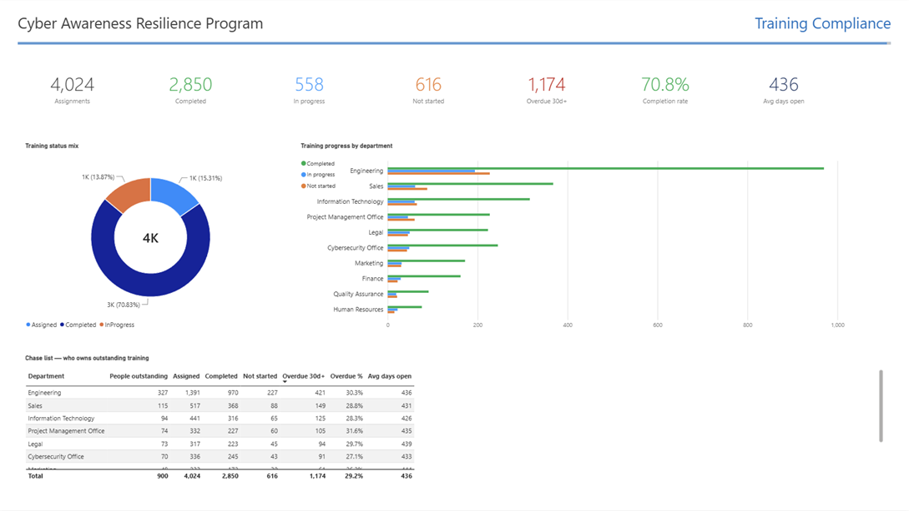</a><br><b>Training Compliance</b>: assigned against completed, with overdue training.</td>
<td valign="top"><a href="docs/images/report/07-technique-effectiveness.png">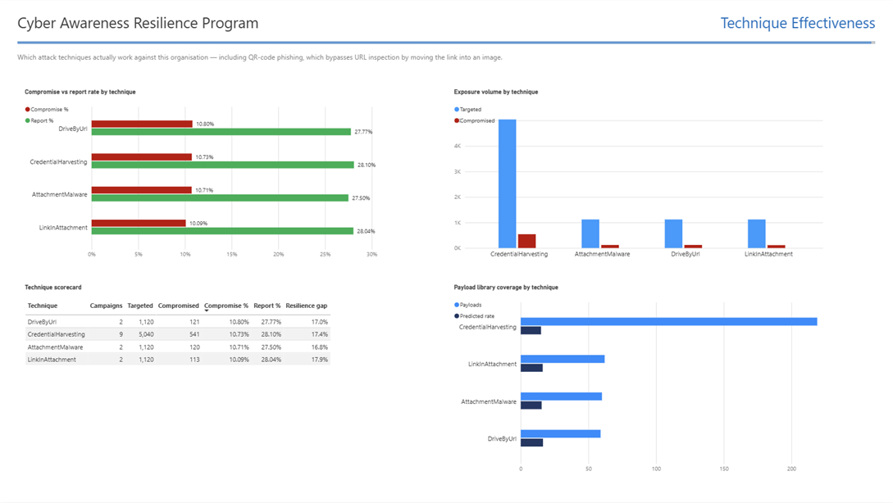</a><br><b>Technique Effectiveness</b>: which lures work, including QR codes.</td>
</tr>
<tr>
<td valign="top"><a href="docs/images/report/08-campaign-operations.png">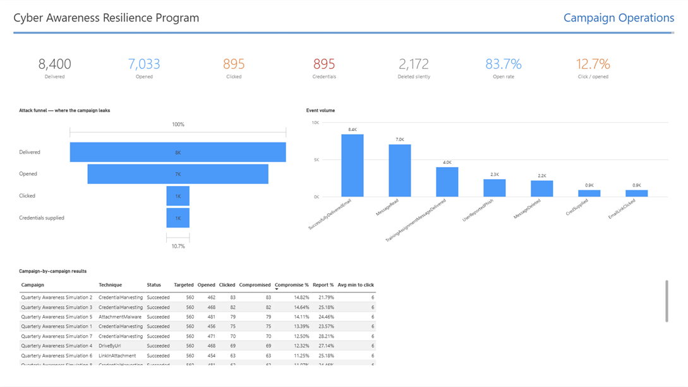</a><br><b>Campaign Operations</b>: delivery, opens and clicks per campaign.</td>
<td valign="top"><a href="docs/images/report/09-risk-analytics.png">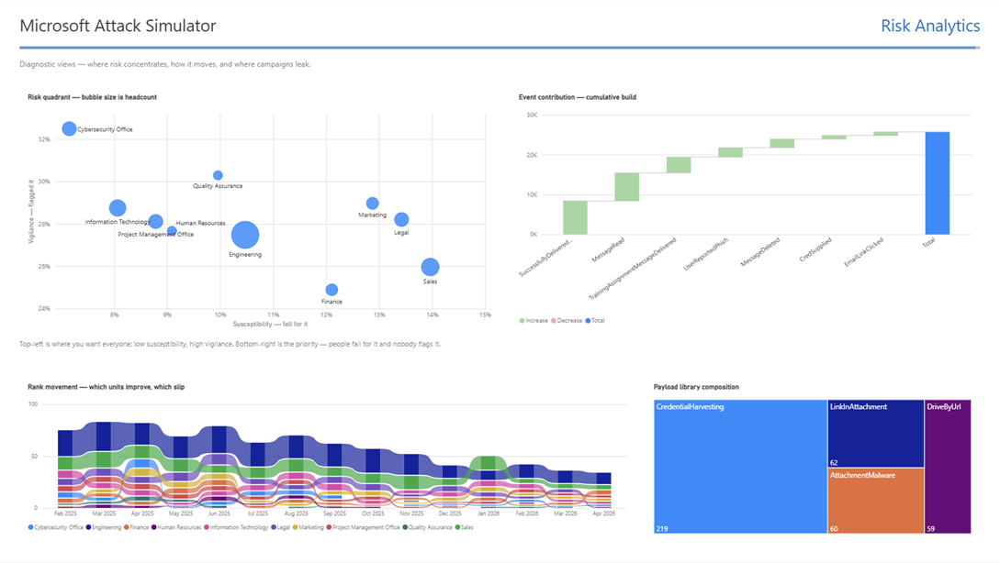</a><br><b>Risk Analytics</b>: susceptibility against vigilance by department.</td>
</tr>
<tr>
<td valign="top"><a href="docs/images/report/10-explorer.png">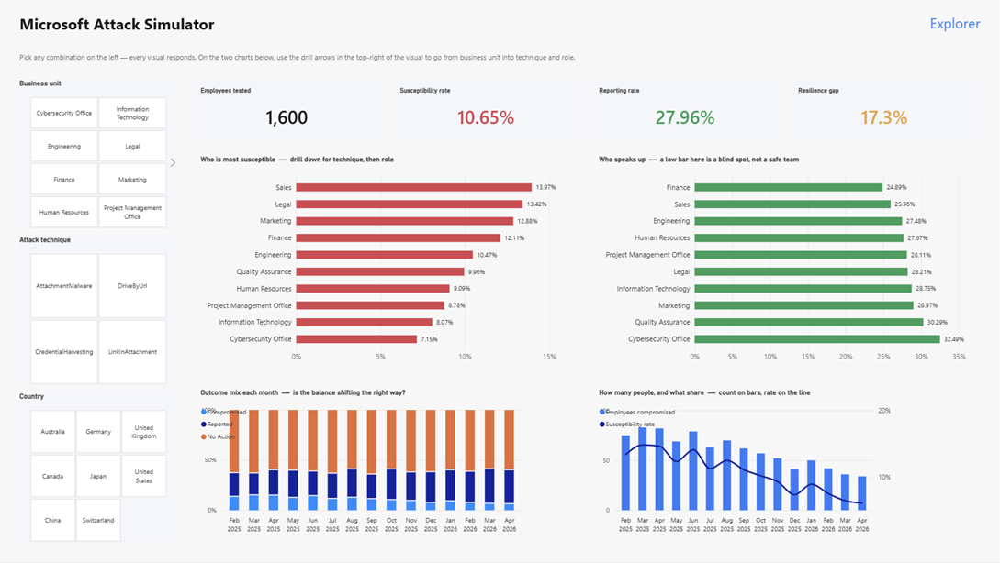</a><br><b>Explorer</b>: slice by department, technique and country.</td>
<td valign="top"><a href="docs/images/report/04-executive-summary.png"></a><br><b>Executive Summary</b>: one screen for a leadership readout.</td>
</tr>
</table>

## How it works

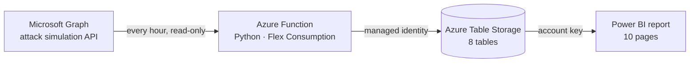
```mermaid
flowchart LR
    G["Microsoft Graph<br/>attack simulation API"] -->|every hour, read-only| F["Azure Function<br/>Python · Flex Consumption"]
    F -->|managed identity| T[("Azure Table Storage<br/>8 tables")]
    T -->|account key| P["Power BI report<br/>10 pages"]
```

The function writes the same seven tables, with the same column names, as [cammurray/ASTSync](https://github.com/cammurray/ASTSync), so reports built on that project keep working:

| Table | Source (Microsoft Graph) |
|---|---|
| `Simulations` | `/beta/security/attackSimulation/simulations` |
| `SimulationUsers`, `SimulationUserEvents` | `/beta/security/attackSimulation/simulations/{id}/report/simulationUsers` |
| `Users` | `/v1.0/users` (via `$batch`, 20 per call) |
| `Trainings` | `/beta/security/attackSimulation/trainings` |
| `Payloads` | `/beta/security/attackSimulation/payloads` |
| `TrainingUserCoverage` | `/beta/reports/security/getAttackSimulationTrainingUserCoverage` |

A small `SyncState` table records when Microsoft's catalogues were last refreshed.

**Why it's efficient:**

- **Hourly runs only read what changed**: simulations that are running, finished recently, or not synced for a month.
- **User profiles in batches**: 20 users per Graph `$batch` call, and only users not refreshed in the last 7 days.
- **Catalogues once a day**: Microsoft's 5,000+ global payloads and trainings are refreshed every 24 hours, not every hour.
- **Throttling-aware**: honors Graph `Retry-After`, with backoff.
- **Batched writes**: up to 100 rows per Table Storage transaction.

In testing, a full first run took about 2 minutes; a normal hourly run took **6 seconds and 3 Graph calls**.

## Build it in the portal

The [step-by-step guide](docs/build-in-the-portal.md) has a screenshot for every step. Select a card to jump to that part.

<table>
<tr>
<td width="25%" valign="top"><a href="docs/build-in-the-portal.md#part-1-resource-group-and-storage-account">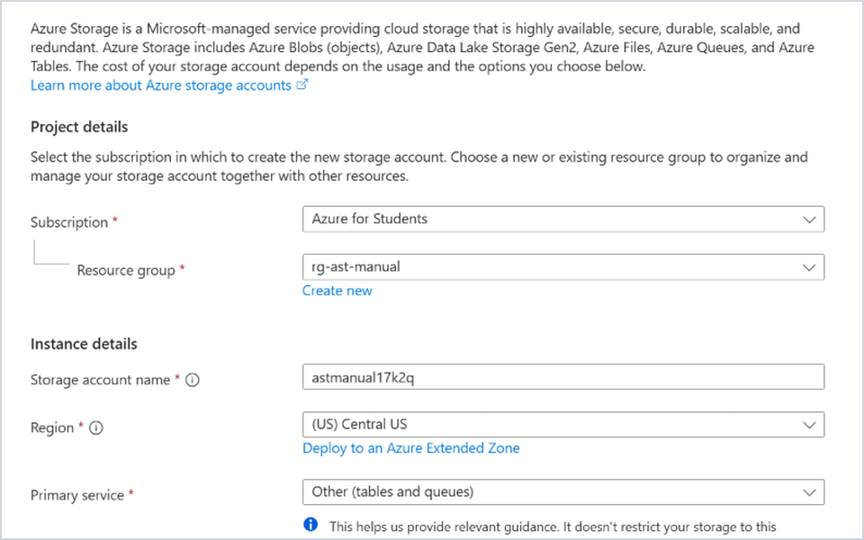</a><br><b>1. Storage account</b><br><sub>Holds the eight tables.</sub></td>
<td width="25%" valign="top"><a href="docs/build-in-the-portal.md#part-2-app-registration-for-microsoft-graph">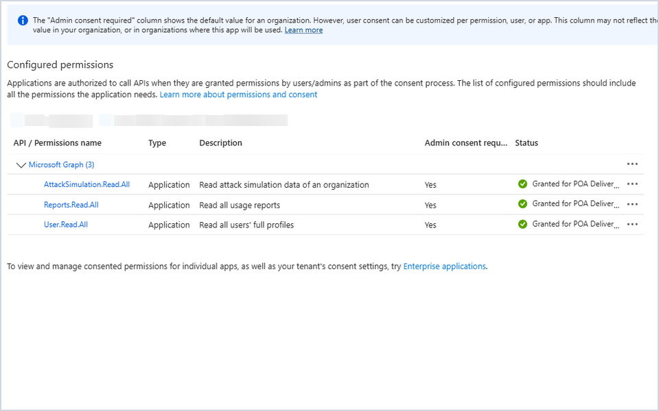</a><br><b>2. App registration</b><br><sub>Three read-only Graph permissions.</sub></td>
<td width="25%" valign="top"><a href="docs/build-in-the-portal.md#part-3-function-app">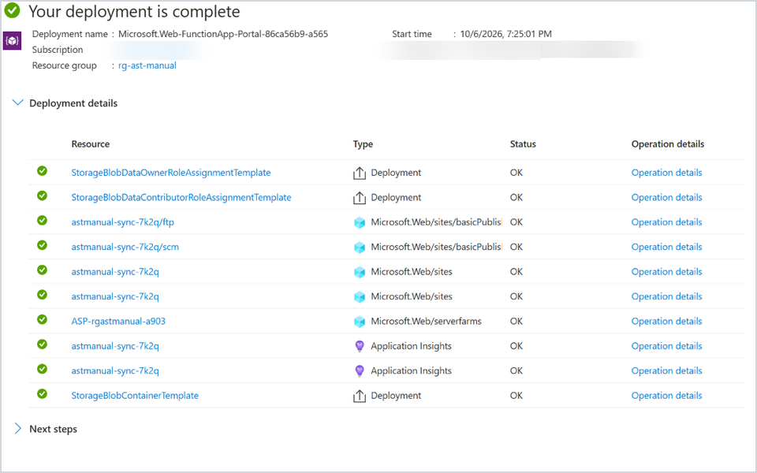</a><br><b>3. Function App</b><br><sub>Python on Flex Consumption.</sub></td>
<td width="25%" valign="top"><a href="docs/build-in-the-portal.md#33-authentication">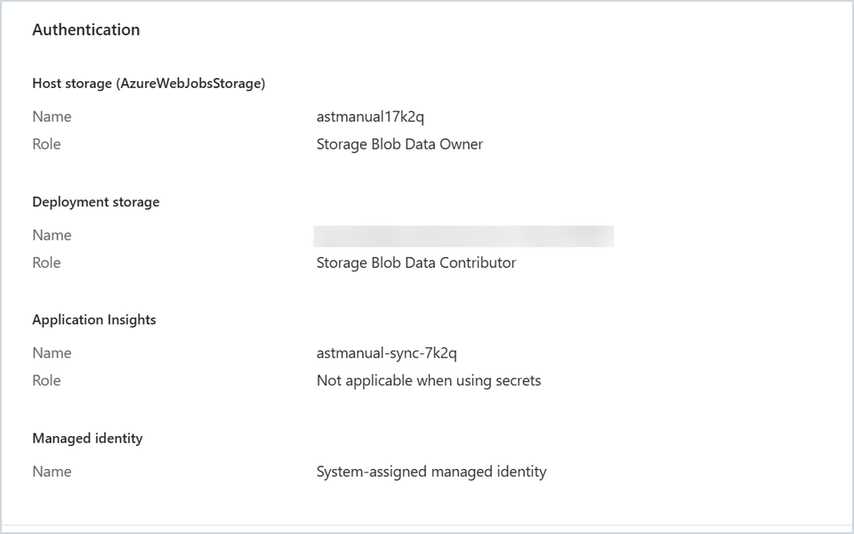</a><br><b>4. Managed identity</b><br><sub>No storage keys in the app.</sub></td>
</tr>
<tr>
<td valign="top"><a href="docs/build-in-the-portal.md#part-4-let-the-function-app-write-to-the-tables">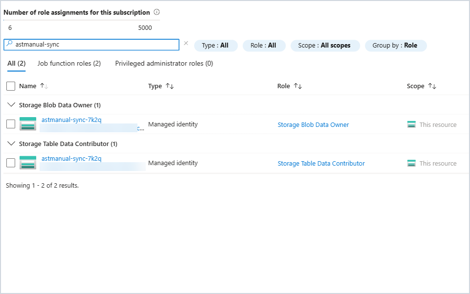</a><br><b>5. Table role</b><br><sub>Let the app write its tables.</sub></td>
<td valign="top"><a href="docs/build-in-the-portal.md#51-app-settings">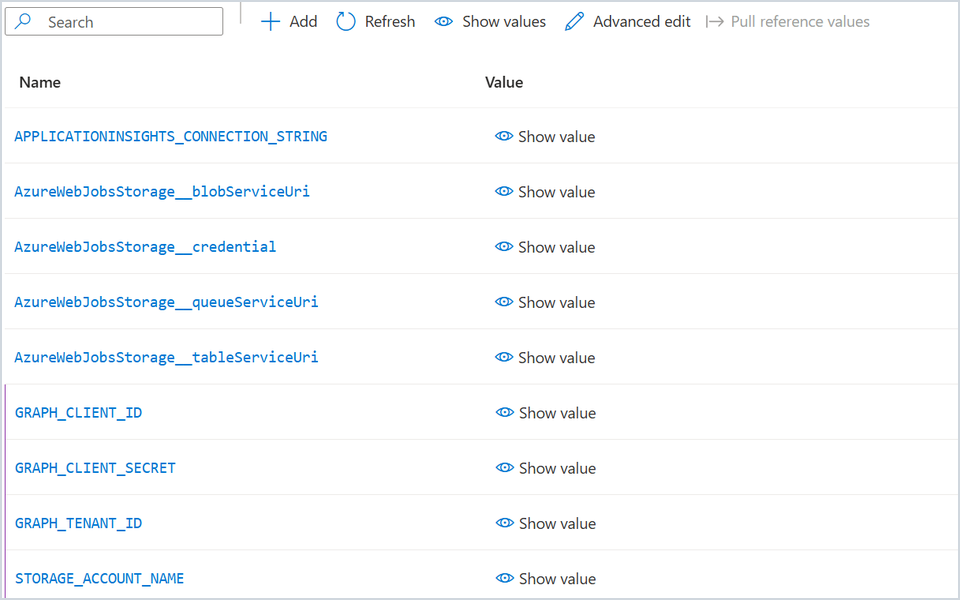</a><br><b>6. App settings</b><br><sub>Five settings, one secret.</sub></td>
<td valign="top"><a href="docs/build-in-the-portal.md#52-deploy-the-code">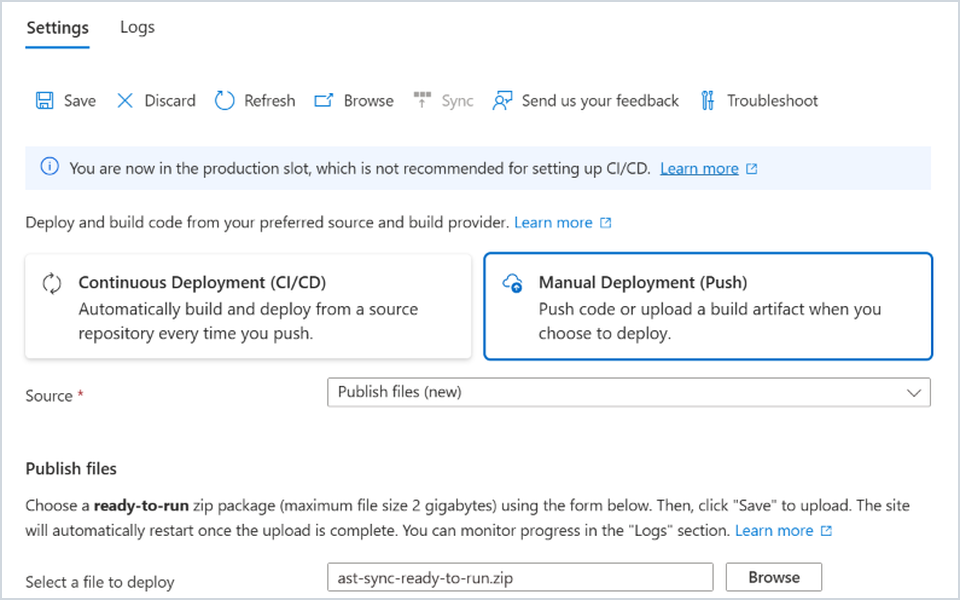</a><br><b>7. Deploy the code</b><br><sub>Upload one zip, no tools.</sub></td>
<td valign="top"><a href="docs/build-in-the-portal.md#part-6-first-run">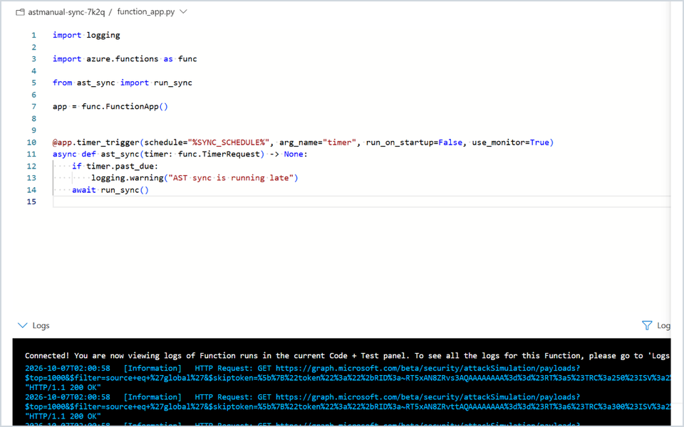</a><br><b>8. First run</b><br><sub>Then connect Power BI.</sub></td>
</tr>
</table>
## Deploy

**[Build it in the portal](docs/build-in-the-portal.md)**: a step-by-step guide with screenshots. It covers the storage account, the app registration, the Function App, the role assignment, the settings, the code upload and connecting the Power BI report.

Download from the [AttackSimulator v1.0.0 release](https://github.com/Muatazawad2/Email/releases/tag/attacksimulator-v1.0.0):

| File | What it is |
|---|---|
| `ast-sync-ready-to-run.zip` | The code plus its Python packages (Linux x86-64, Python 3.12), for the portal's **Deployment Center > Publish files** |
| `ASTReporting.pbit` | The ten-page Power BI report template (also in [`powerbi/`](powerbi)) |

To build the zip yourself, run `.\build-package.ps1` from this folder.

## Power BI report

`powerbi/ASTReporting.pbit` asks for the storage account name when it opens, then for the storage **account key** (the Power BI Table Storage connector only supports account keys). It has ten pages, 56 measures and two row-level security roles:

| Role | Sees |
|---|---|
| **Security Team** | Everyone |
| **End User Self Service** | Only the signed-in user's own results (`Users[Mail] = USERPRINCIPALNAME()`) |

### Publish and schedule refresh

1. In Power BI Desktop, select **Home > Publish** and choose a shared workspace. This needs Power BI Pro or Premium Per User, unless the workspace is on a Premium or Fabric capacity.
2. In the Power BI service, open the semantic model's **Settings > Data source credentials > Edit credentials**. Choose **Key**, paste the storage account key, and set the privacy level to **Organizational**.
3. Under **Refresh**, turn on a schedule. The sync writes hourly, so 2–4 refreshes a day is plenty.
4. Under **Security**, add the security team to **Security Team** and employees to **End User Self Service**. Give employees the workspace **Viewer** role or share through an app: Admins, Members and Contributors bypass row-level security.

No gateway is needed. When the storage key rotates, update it in step 2.

## Settings

| Setting | Required | Description |
|---|---|---|
| `SYNC_SCHEDULE` | Yes | CRON schedule, for example `0 0 * * * *` (top of every hour) |
| `STORAGE_ACCOUNT_NAME` | Yes | Table Storage account. The Function App's managed identity needs **Storage Table Data Contributor** on it. |
| `GRAPH_TENANT_ID` | Cross-tenant only | Tenant that holds the simulation data |
| `GRAPH_CLIENT_ID` | Cross-tenant only | App registration with `AttackSimulation.Read.All`, `Reports.Read.All` and `User.Read.All` (application) |
| `GRAPH_CLIENT_SECRET` | Cross-tenant only | Secret for that app registration |
| `SYNC_ENTRA_USERS` | No | `false` to skip user profiles (default `true`) |
| `USER_REFRESH_DAYS` | No | Re-read a user's profile after this many days (default `7`) |
| `SIM_RESYNC_DAYS` | No | Re-read users of simulations completed within this many days (default `7`) |
| `CATALOGUE_REFRESH_HOURS` | No | Refresh Microsoft's catalogues this often (default `24`) |
| `MAX_PARALLEL_SIMULATIONS` | No | Simulations read at the same time (default `4`) |

When the three `GRAPH_*` settings are omitted, the Function App's own managed identity is used for Graph (same-tenant deployments).

## Run locally

```powershell
cd AttackSimulator
python -m venv .venv; .venv\Scripts\activate
pip install -r requirements.txt
$env:STORAGE_CONNECTION_STRING = "<connection string>"   # or STORAGE_ACCOUNT_NAME + az login
$env:GRAPH_TENANT_ID = "..."; $env:GRAPH_CLIENT_ID = "..."; $env:GRAPH_CLIENT_SECRET = "..."
python ast_sync.py
```

## Credits

Table design and Graph mapping follow [Cam Murray's ASTSync](https://github.com/cammurray/ASTSync).

---

**Developer**: Dr. Muataz Awad
