# Build it in the portal

This guide builds the whole Attack Simulation Training reporting pipeline by hand, in the Azure portal and Power BI Desktop. Every step has a screenshot.

```
Microsoft Graph ──► Function App (Python, every hour) ──► Azure Table Storage ──► Power BI report
 attack simulation     Flex Consumption                     8 tables               ASTReporting.pbit
```

It takes about 40 minutes. When you're done, the Function App copies new simulation results every hour, and the Power BI report reads them.

## Contents

- [Before you start](#before-you-start)
- [Part 1: Resource group and storage account](#part-1-resource-group-and-storage-account)
- [Part 2: Function App](#part-2-function-app)
- [Part 3: Let the Function App write to the tables](#part-3-let-the-function-app-write-to-the-tables)
- [Part 4: Let the Function App read Microsoft Graph](#part-4-let-the-function-app-read-microsoft-graph)
- [Part 5: Settings and code](#part-5-settings-and-code)
- [Part 6: First run](#part-6-first-run)
- [Part 7: Connect the Power BI report](#part-7-connect-the-power-bi-report)
- [Troubleshooting](#troubleshooting)
- [Keeping it running](#keeping-it-running)
- [Remove everything](#remove-everything)
- [If Azure and Microsoft 365 are in different tenants](#if-azure-and-microsoft-365-are-in-different-tenants)

## Before you start

This guide assumes your Azure subscription and your Microsoft 365 tenant are **in the same Microsoft Entra tenant**, which is the usual case. The Function App then signs in to Microsoft Graph with its own managed identity: no app registration and no secret. If they're in different tenants, see the [last section](#if-azure-and-microsoft-365-are-in-different-tenants).

| You need | Why |
|---|---|
| An Azure subscription where you're **Owner** (or Contributor + User Access Administrator) | To create the resources and assign one role |
| **Global Administrator** or **Privileged Role Administrator** in Microsoft Entra ID | To give the Function App its three read-only Graph permissions (Part 4) |
| **Power BI Desktop** | To open the report template |
| Two files from the [AttackSimulator v1.0.0 release](https://github.com/Muatazawad2/Email/releases/tag/attacksimulator-v1.0.0) | [`ast-sync-ready-to-run.zip`](https://github.com/Muatazawad2/Email/releases/download/attacksimulator-v1.0.0/ast-sync-ready-to-run.zip) (the code) and [`ASTReporting.pbit`](https://github.com/Muatazawad2/Email/releases/download/attacksimulator-v1.0.0/ASTReporting.pbit) (the report) |

Pick names before you start. This guide uses:

| Resource | Name used here | Rule |
|---|---|---|
| Resource group | `rg-ast-manual` | Any name |
| Storage account | `astmanual17k2q` | 3–24 lowercase letters and numbers, unique across Azure |
| Function App | `astmanual-sync-7k2q` | Unique across Azure |
| Region | Central US | Any region that offers Flex Consumption |

## Part 1: Resource group and storage account

The storage account holds the eight tables the report reads. The Function App also keeps its own files there.

### 1.1 Sign in to the Azure portal

Sign in to [portal.azure.com](https://portal.azure.com) and open the subscription you'll use. Check **My role** says **Owner**.

<p>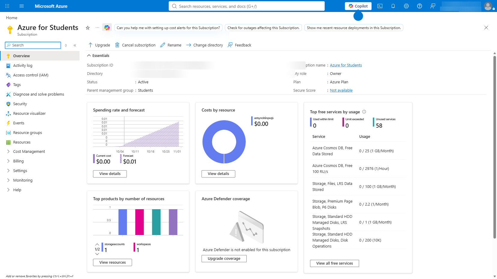</p>

### 1.2 Create the resource group

1. Search for **Resource groups** and select **+ Create**.
2. Choose the **Subscription**, enter the **Resource group** name, and choose the **Region**.
3. Select **Review + create**, then **Create**.

<table><tr>
<td>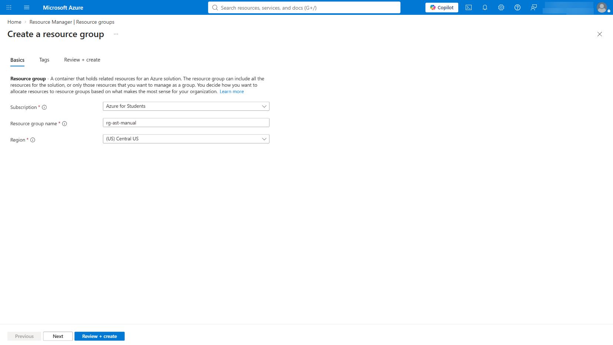</td>
<td>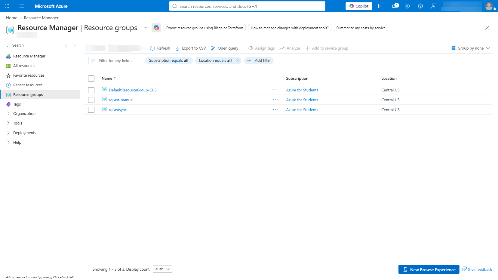</td>
</tr></table>

### 1.3 Create the storage account

Open the resource group, select **+ Create**, search for **Storage account**, and select **Create**.

**Basics**

| Setting | Value |
|---|---|
| Storage account name | your storage name |
| Region | same as the resource group |
| Primary service | **Other (tables and queues)** |
| Performance | Standard |
| Redundancy | Locally redundant storage (LRS) |

<p>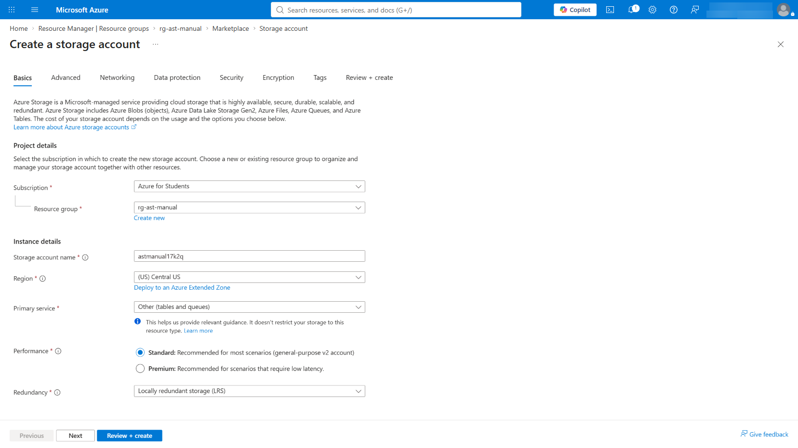</p>

**Advanced** and **Data protection**: leave the defaults.

<table><tr>
<td>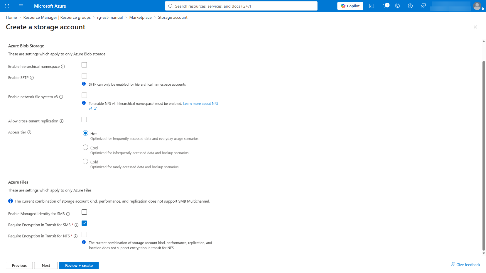</td>
<td>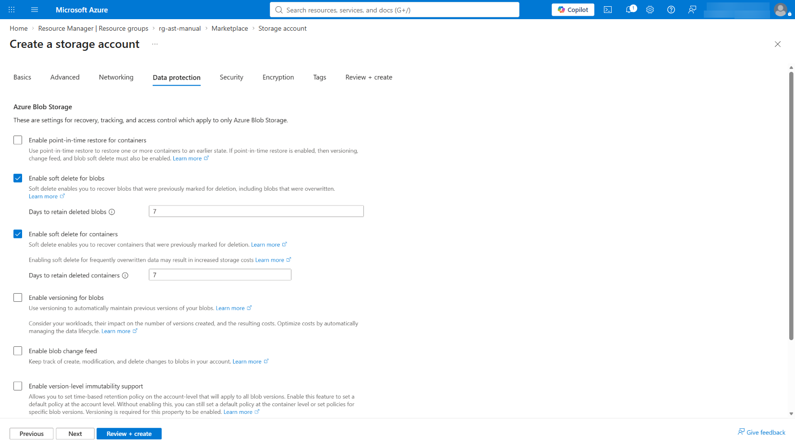</td>
</tr></table>

**Networking**: keep **Public network access** set to **Enable**, **from all networks**. Power BI and the Function App both need to reach it.

<p>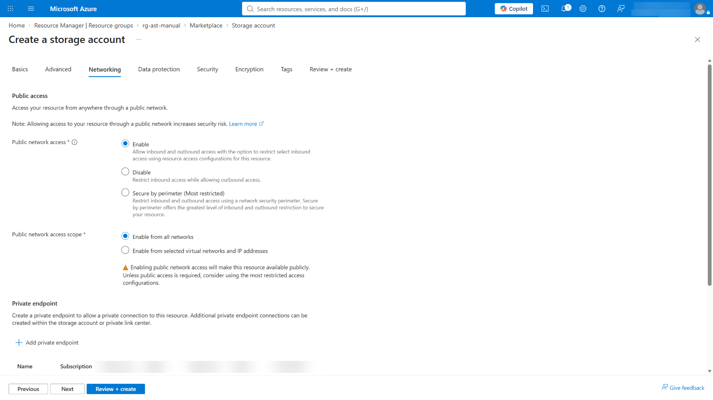</p>

**Security**: these settings matter.

| Setting | Value | Why |
|---|---|---|
| Require secure transfer | ✅ On | HTTPS only |
| Allow enabling anonymous access | ⬜ Off | No public containers |
| **Enable storage account key access** | ✅ **On** | The Power BI Table Storage connector only signs in with an account key |
| Default to Microsoft Entra authorization in the Azure portal | ⬜ Off | Keeps browsing the tables in the portal simple |
| Minimum TLS version | 1.2 | |

<p>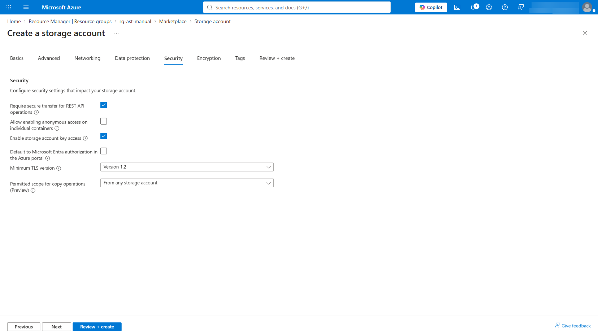</p>

Select **Review + create**, check the summary, then **Create**.

<table><tr>
<td>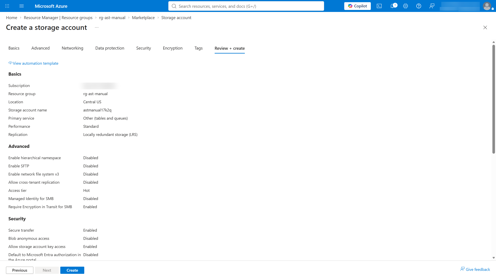</td>
<td>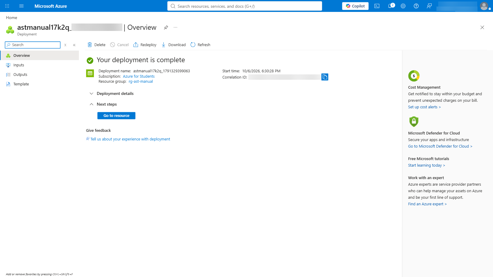</td>
</tr></table>

## Part 2: Function App

The Function App runs the sync code on a timer. On the Flex Consumption plan you pay only while it runs, which is a few seconds an hour.

Open the resource group, select **+ Create**, search for **Function App**, and select **Create**. Choose **Flex Consumption**.

### 2.1 Basics

| Setting | Value |
|---|---|
| Function App name | your Function App name |
| Region | same as the storage account |
| **Runtime stack** | **Python** |
| **Version** | **3.12** |
| Instance size | 2048 MB |
| Zone redundancy | Disabled |

> [!IMPORTANT]
> Choose **Python 3.12**. The screenshot shows .NET; the runtime in this lab was changed to Python 3.12 afterwards.

<p>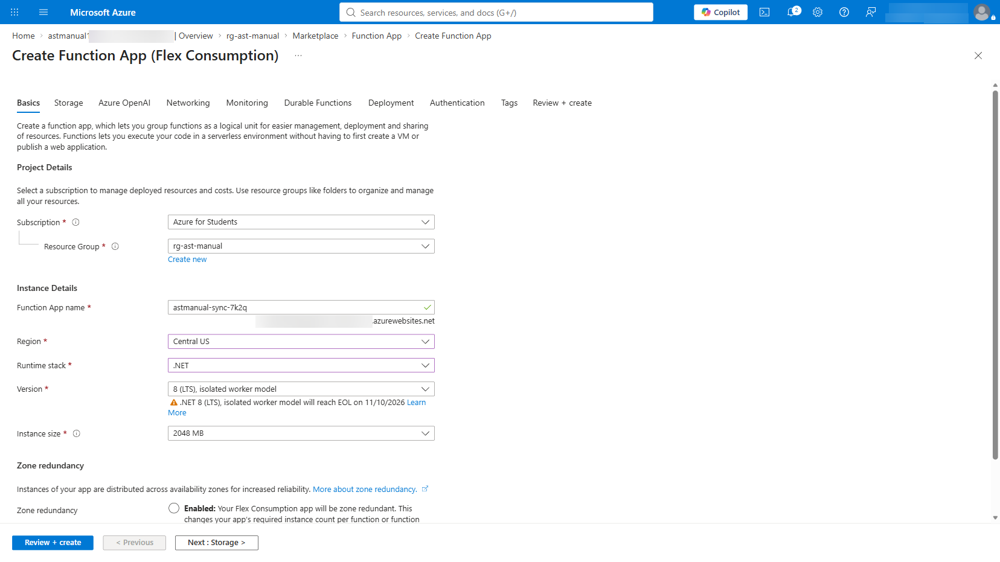</p>

### 2.2 Storage and monitoring

- **Storage**: choose the storage account you created, not **Create new**.
- **Monitoring**: **Enable Application Insights** = **Yes**. It keeps the run logs.

<table><tr>
<td>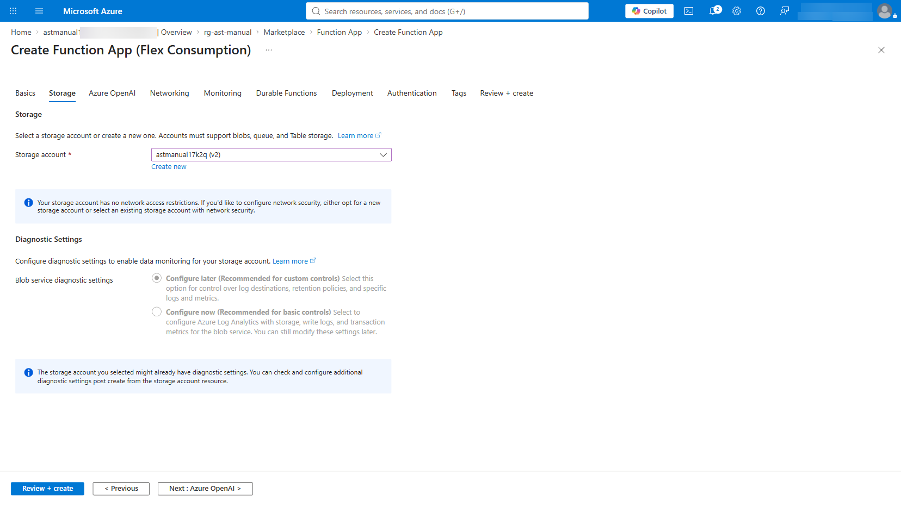</td>
<td>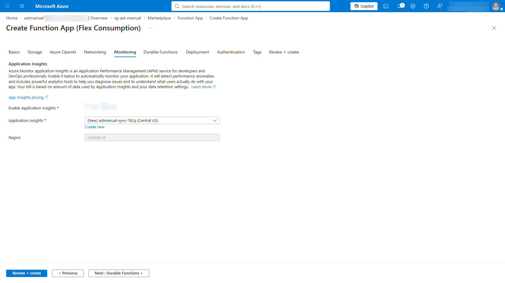</td>
</tr></table>

Leave **Azure OpenAI**, **Networking** and **Durable Functions** at their defaults. On **Deployment**, leave continuous deployment disabled.

### 2.3 Authentication

This decides how the Function App proves who it is. Use managed identity wherever you can, so no keys or secrets sit in the app's settings. The same identity reads Microsoft Graph in Part 4.

| Resource | Authentication type |
|---|---|
| Host storage (AzureWebJobsStorage) | **Managed identity** |
| Deployment storage | Managed identity |
| Application Insights | Secrets (default) |
| Managed identity | **System-assigned managed identity** |

<p>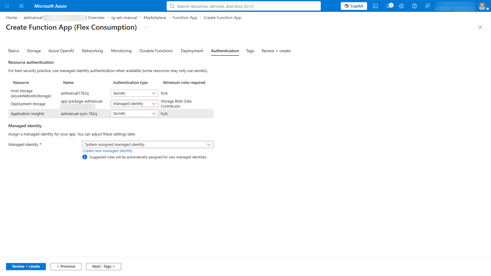</p>

> [!NOTE]
> The screenshot shows Host storage still on **Secrets**. Change it to **Managed identity**; the review page below shows the result.

### 2.4 Review and create

Check the summary, then select **Create**. It takes 1–3 minutes. The portal also assigns the identity two blob roles on the storage account.

<table><tr>
<td>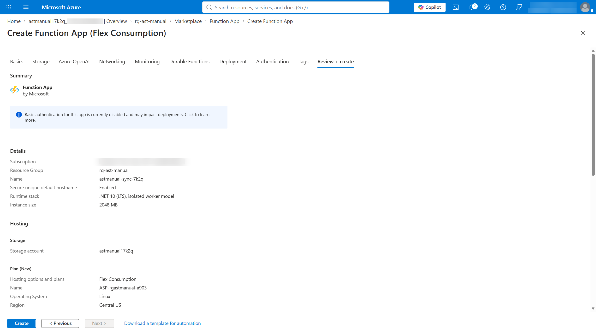</td>
<td>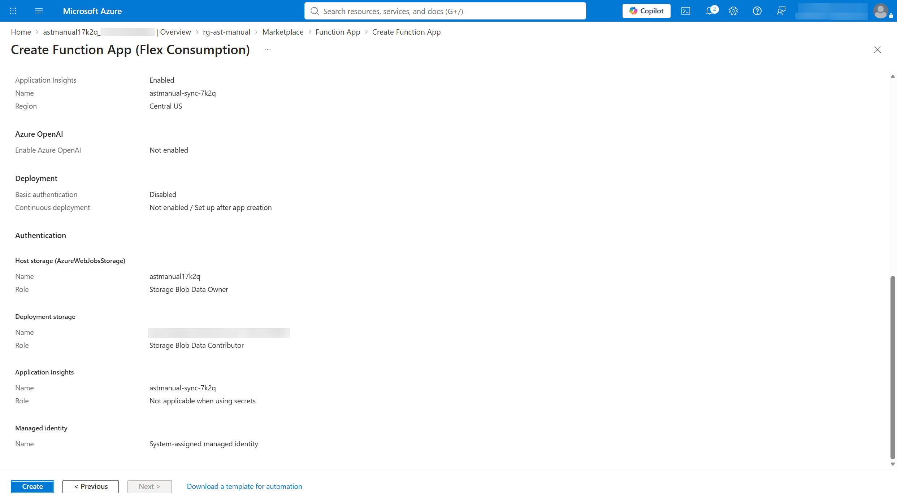</td>
</tr></table>

<p>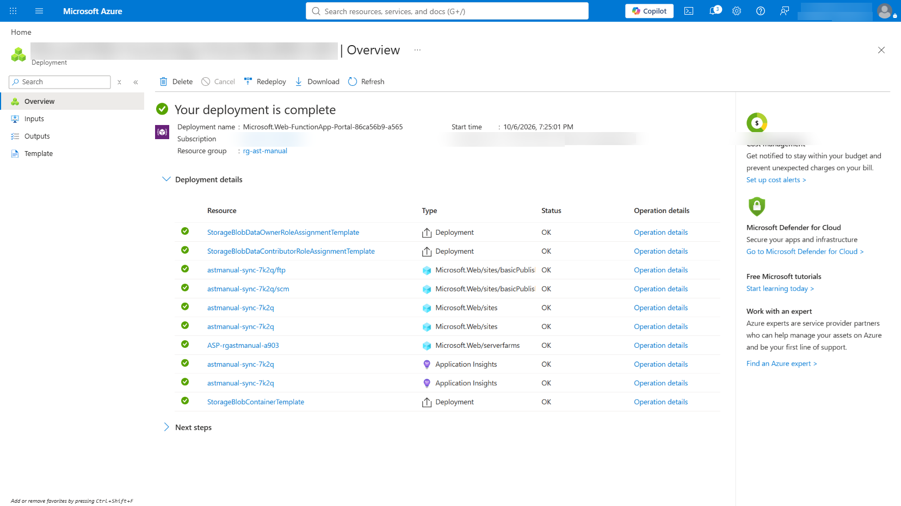</p>

## Part 3: Let the Function App write to the tables

The portal gave the Function App access to **blobs**. The sync writes to **tables**, so add that role yourself.

1. Open the **storage account** > **Access control (IAM)** > **+ Add** > **Add role assignment**.
2. Select **Storage Table Data Contributor** and select **Next**. It can read, write and delete tables and their rows, and nothing else.
3. **Assign access to**: **Managed identity**. **+ Select members** > **Function App** > your Function App.
4. Select **Review + assign** twice.

<table><tr>
<td>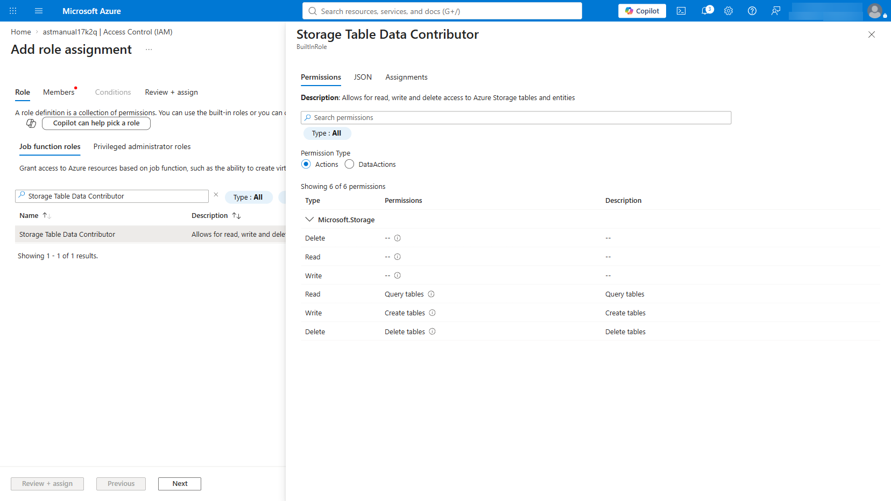</td>
<td>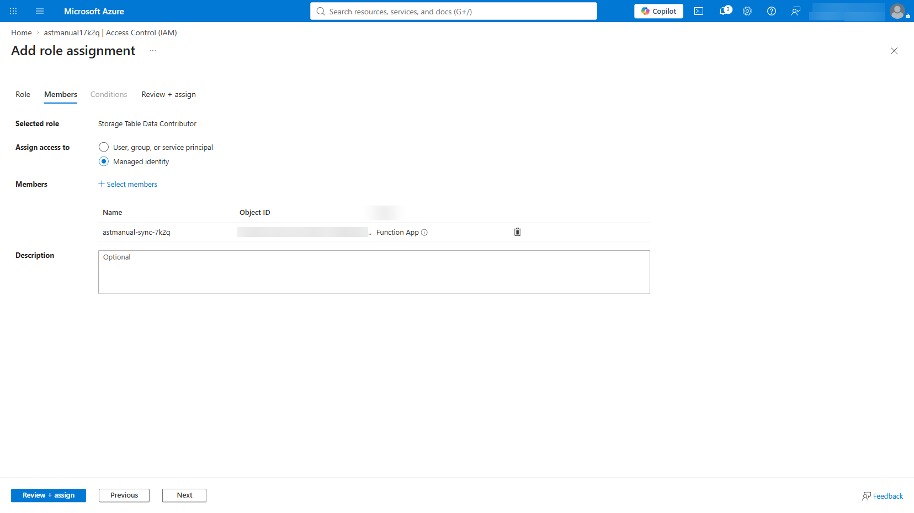</td>
</tr></table>

On the **Role assignments** tab, search for your Function App's name. It has **Storage Blob Data Owner** and **Storage Table Data Contributor** on the storage account. The third role, **Storage Blob Data Contributor**, is on the deployment container.

<p>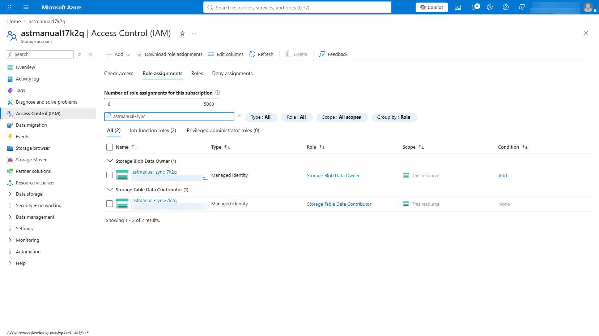</p>

## Part 4: Let the Function App read Microsoft Graph

The Function App's managed identity needs three **read-only** Microsoft Graph application permissions:

| Permission | Used for |
|---|---|
| `AttackSimulation.Read.All` | Simulations, per-user results and events, trainings, payloads |
| `Reports.Read.All` | Training completion per user |
| `User.Read.All` | Department, job title and country, for the business unit pages |

The portal has no screen for giving a managed identity Graph permissions, so use **Cloud Shell** inside the portal:

1. Select the **Cloud Shell** icon (`>_`) in the portal's top bar and choose **PowerShell**. Sign-in is automatic.
2. Paste this, replacing the two names, and press **Enter**. Run it as a Global Administrator or Privileged Role Administrator.

```powershell
$resourceGroup = 'rg-ast-manual'          # your resource group
$functionApp   = 'astmanual-sync-7k2q'    # your Function App

$principalId = (Get-AzResource -ResourceGroupName $resourceGroup -ResourceType 'Microsoft.Web/sites' -Name $functionApp).Identity.PrincipalId
$t = Get-AzAccessToken -ResourceTypeName MSGraph
$token = if ($t.Token -is [securestring]) { [System.Net.NetworkCredential]::new('', $t.Token).Password } else { $t.Token }
$headers = @{ Authorization = "Bearer $token" }
$graph = (Invoke-RestMethod -Headers $headers -Uri "https://graph.microsoft.com/v1.0/servicePrincipals?`$filter=appId eq '00000003-0000-0000-c000-000000000000'").value[0]
foreach ($permission in 'AttackSimulation.Read.All', 'Reports.Read.All', 'User.Read.All') {
    $role = $graph.appRoles | Where-Object { $_.value -eq $permission -and $_.allowedMemberTypes -contains 'Application' }
    $body = @{ principalId = $principalId; resourceId = $graph.id; appRoleId = $role.id } | ConvertTo-Json
    try {
        Invoke-RestMethod -Method Post -Headers $headers -ContentType 'application/json' -Body $body `
            -Uri "https://graph.microsoft.com/v1.0/servicePrincipals/$principalId/appRoleAssignments" | Out-Null
        Write-Host "Granted $permission"
    } catch {
        if ("$($_.ErrorDetails.Message)" -match 'already exists') { Write-Host "Already granted: $permission" } else { throw }
    }
}
```

It prints **Granted** for each permission. It's safe to run again.

To check: in the [Microsoft Entra admin center](https://entra.microsoft.com), open **Enterprise apps**, set **Application type** to **Managed Identities**, open your Function App, and select **Permissions**. All three are listed as **Application** permissions.

## Part 5: Settings and code

### 5.1 App settings

Open the **Function App** > **Settings** > **Environment variables** > **App settings**. Add two settings with **+ Add**:

| Name | Value |
|---|---|
| `SYNC_SCHEDULE` | `0 0 * * * *` (top of every hour, UTC) |
| `STORAGE_ACCOUNT_NAME` | your storage account name |

Then select **Apply** at the bottom of the list, and **Confirm**. New settings show a purple bar until you apply them; until then nothing is saved.

<p>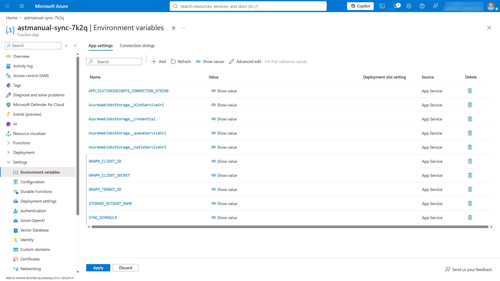</p>

The screenshot also shows three `GRAPH_*` settings. You need those only [when Microsoft 365 is in another tenant](#if-azure-and-microsoft-365-are-in-different-tenants). Optional settings are listed in the [README](../README.md#settings).

### 5.2 Deploy the code

The Flex Consumption plan has no in-portal code editor. Upload the code as a zip instead.

1. Download [`ast-sync-ready-to-run.zip`](https://github.com/Muatazawad2/Email/releases/download/attacksimulator-v1.0.0/ast-sync-ready-to-run.zip). It contains the code **and** the Python packages it needs, built for the Function App's platform (Linux x86-64, Python 3.12). You can also build it yourself with [`build-package.ps1`](../build-package.ps1).
2. In the Function App, open **Deployment** > **Deployment Center**.
3. Select **Manual Deployment (Push)**. **Source**: **Publish files (new)**.
4. **Browse** to the zip and select **Save**.
5. Open the **Logs** tab. After a minute or two the deployment shows **Succeeded (Active)**.

<table><tr>
<td>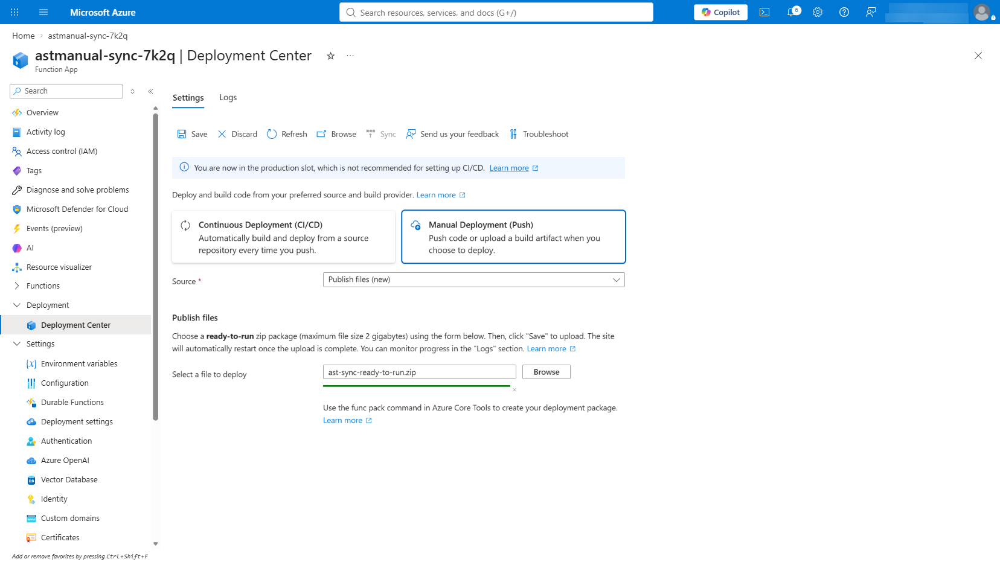</td>
<td>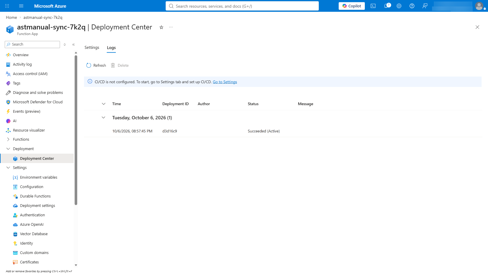</td>
</tr></table>

> [!TIP]
> The **Publish files** option doesn't install packages, which is why the zip carries them. If you'd rather upload only the code, use Cloud Shell and let Azure install the packages:
> ```powershell
> az functionapp deployment source config-zip -g <resource-group> -n <function-app> --src ./code-only.zip --build-remote true
> ```

## Part 6: First run

The timer fires at the top of every hour (UTC). To run it now, open **Functions** > **ast_sync** > **Code + Test** > **Test/Run** > **Run**. The response is **202 Accepted** and the log panel shows the run.

<p>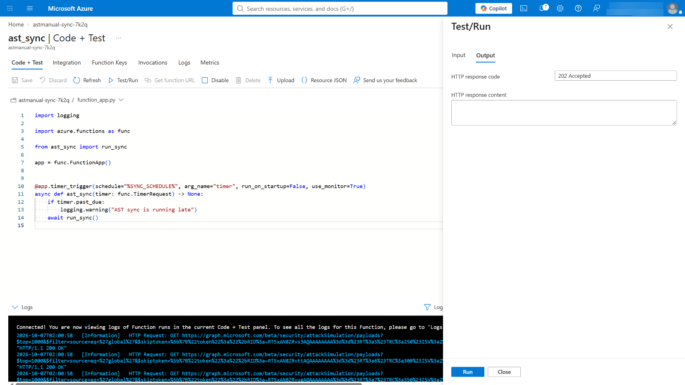</p>

The first run copies everything and takes a few minutes. Later runs only read what changed and finish in seconds.

To check the data, open the storage account > **Storage browser** > **Tables**. You'll see eight tables:

| Table | What's in it |
|---|---|
| `Simulations` | One row per simulation |
| `SimulationUsers` | One row per targeted user per simulation: compromised, reported, training counts |
| `SimulationUserEvents` | Each delivered, opened, clicked, credential and reported event |
| `Users` | Department, job title and country of targeted users |
| `Trainings` | The training catalogue |
| `Payloads` | Your payloads plus Microsoft's global catalogue |
| `TrainingUserCoverage` | Training assignments and completion per user |
| `SyncState` | When the catalogues were last refreshed |

## Part 7: Connect the Power BI report

### 7.1 Copy the storage key

Open the storage account > **Security + networking** > **Access keys**. Next to **key1**, select **Show**, then copy the **Key**.

<p>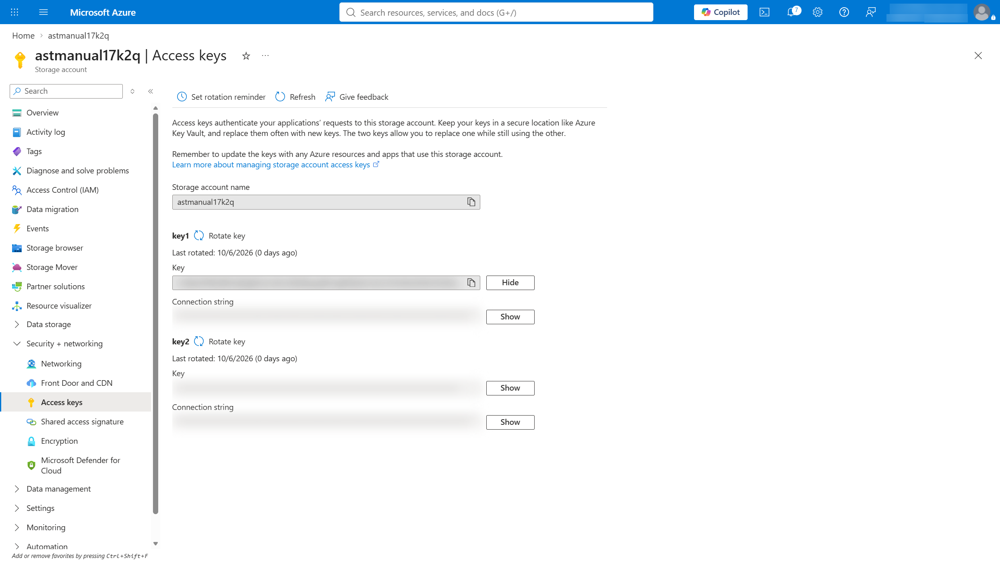</p>

### 7.2 Open the template

1. Download [`ASTReporting.pbit`](https://github.com/Muatazawad2/Email/releases/download/attacksimulator-v1.0.0/ASTReporting.pbit) and open it in Power BI Desktop.
2. In **StorageAccount**, type your storage account name and select **Load**.
3. Power BI asks how to connect to **Azure Table storage**. Choose **Account key**, paste key1, and select **Connect**.

<p>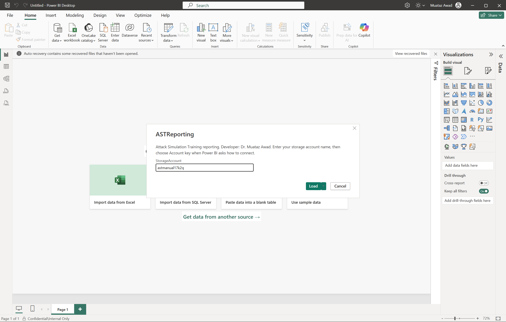</p>

### 7.3 The report

After about a minute the ten pages fill with your data.

<p>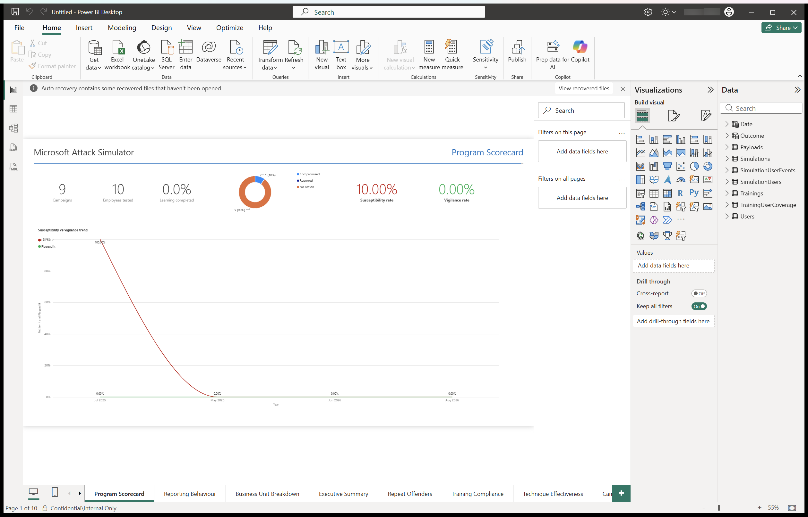</p>

Save it as a `.pbix` (**Ctrl+S**). Power BI keeps refreshed data in memory until you save.

To keep it current without opening Desktop, publish it and set a scheduled refresh: see [Publish and schedule refresh](../README.md#publish-and-schedule-refresh).

## Troubleshooting

| What you see | Cause | Fix |
|---|---|---|
| **"A cyclic reference was encountered during evaluation"** or **"7 queries are blocked"** after Load | Power BI tried to load before it had a storage key | Select **Close** > **Transform data**. On the yellow bar **Please specify how to connect**, select **Edit Credentials** > **Account key**. |
| **Connect** doesn't take the key; **"An account key wasn't specified"** stays | The key field didn't receive the pasted text | Click in the field, press **Ctrl+A**, and paste or type the key again. Copy it fresh from **Access keys** first. |
| **ResourceAccessForbiddenException** on every table | The storage key Power BI saved was rotated | **File** > **Options and settings** > **Data source settings** > select the storage URL > **Edit Permissions** > **Edit**, and enter the current key. |
| Function run fails with **Authorization_RequestDenied** or **403** from Graph | Part 4 wasn't run, or not as an administrator | Run the Part 4 script again as a Global Administrator or Privileged Role Administrator. Permission changes can take a few minutes. |
| Function run fails with **403** writing to storage | The table role is missing | Repeat [Part 3](#part-3-let-the-function-app-write-to-the-tables). Role changes can take a few minutes to apply. |
| Function run fails with **No module named …** | The zip didn't include the packages | Use `ast-sync-ready-to-run.zip` from the release, not a zip of the source code. |
| `Users` table is empty | `User.Read.All` isn't granted | Check the Function App's **Permissions** in **Enterprise apps** lists all three. |

<p>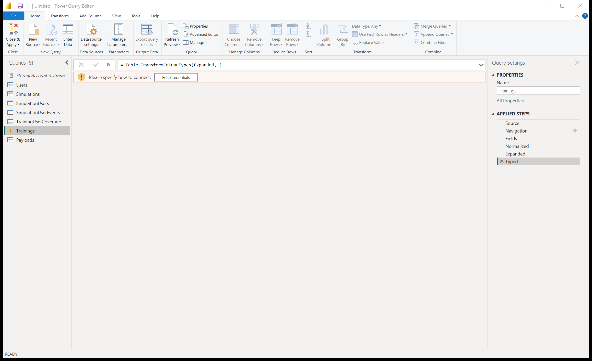</p>

## Keeping it running

| When | Do this |
|---|---|
| You rotate the storage key | Update the credential in Power BI (see Troubleshooting). The Function App isn't affected; it uses its managed identity. |
| You want to change the code | Rebuild the zip with `build-package.ps1` and upload it again in **Deployment Center**. |
| You want it to run more or less often | Change `SYNC_SCHEDULE`, for example `0 0 */4 * * *` for every four hours. |

**Cost**: the Function App runs for a few seconds an hour on Flex Consumption, and the storage holds a few MB. Expect well under $5 a month.

## Remove everything

Delete the resource group. That removes the storage account, the Function App, its managed identity and its Graph permissions, and Application Insights.

## If Azure and Microsoft 365 are in different tenants

A managed identity can't read another tenant's Graph data. Skip [Part 4](#part-4-let-the-function-app-read-microsoft-graph) and instead, in the **Microsoft 365** tenant's Entra admin center:

1. **App registrations** > **+ New registration**: single tenant, no redirect URI.
2. **API permissions** > **Microsoft Graph** > **Application permissions**: add `AttackSimulation.Read.All`, `Reports.Read.All` and `User.Read.All`, then **Grant admin consent**.
3. **Certificates & secrets** > **+ New client secret**, and copy its **Value**.
4. In [Part 5.1](#51-app-settings), add three more app settings: `GRAPH_TENANT_ID` (the Microsoft 365 tenant ID), `GRAPH_CLIENT_ID` (the app's client ID) and `GRAPH_CLIENT_SECRET` (the secret value).

Before the secret expires, create a new one and update `GRAPH_CLIENT_SECRET`.

---

**Developer**: Dr. Muataz Awad
