# Reported-email playbooks for Microsoft Sentinel

[](https://learn.microsoft.com/azure/sentinel/automation/automate-responses-with-playbooks)
[](https://learn.microsoft.com/defender-office-365/submissions-user-reported-messages-custom-mailbox)
[](https://learn.microsoft.com/azure/logic-apps/logic-apps-overview)
[](../LICENSE)

Four Logic Apps playbooks that bring **Microsoft Defender for Office 365 user-reported email** into the Microsoft Sentinel incident:

- **See the status in the incident.** Each reported email gets a short comment with the analyst verdict, Microsoft's analysis, the sender, the reporter and a working **Open in Submissions** link.
- **Act from the incident.** Analysts mark the reported emails as **Phishing**, **Spam** or **No threats found** with **Run playbook**, and Microsoft emails the result to each person who reported one.

[](https://portal.azure.com/#create/Microsoft.Template/uri/https%3A%2F%2Fraw.githubusercontent.com%2FMuatazawad2%2FEmail%2Fmain%2FMDO-Reported-Email-Playbooks%2Fazuredeploy.json)

> [!IMPORTANT]
> This is a community sample, provided as-is. It isn't a supported Microsoft product. The playbooks call the Microsoft Graph **beta** threat-submission API, which Microsoft doesn't support in production and can change.

## Contents

- [Why](#why)
- [What it looks like](#what-it-looks-like)
- [The playbooks](#the-playbooks)
- [How it works](#how-it-works)
- [Screenshots](#screenshots)
- [Prerequisites](#prerequisites)
- [Deploy](#deploy)
- [What gets created](#what-gets-created)
- [Check that it works](#check-that-it-works)
- [Recommended: brand the result email](#recommended-brand-the-result-email)
- [Good to know](#good-to-know)
- [Troubleshooting](#troubleshooting)
- [Remove](#remove)
- [Repository layout](#repository-layout)

## Why

On the Defender alert *Email reported by user as malware or phish*, the **View submission** link opens **Submissions** with an empty **Item ID**. Analysts can't jump from the incident to the report behind it, or see whether anyone has reviewed it yet.

<p align="center">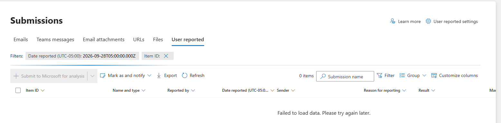<br><sub>The <b>View submission</b> link opens Submissions with an empty Item ID filter, so nothing loads.</sub></p>

These playbooks work around that from inside the incident. Use them until that link is fixed.

## What it looks like

<table>
<tr><th width="50%">Status comment from <b>Details</b></th><th width="50%">Verdict comment from <b>Notify</b></th></tr>
<tr>
<td valign="top" align="center">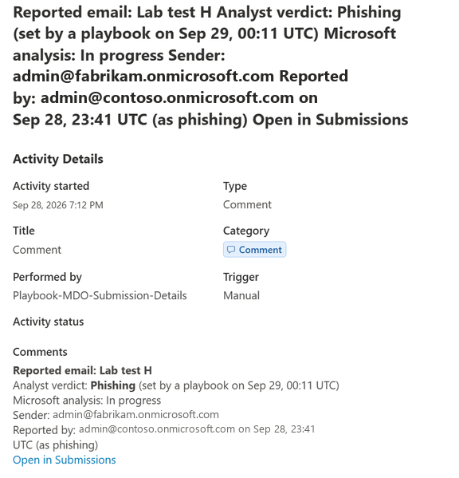</td>
<td valign="top" align="center">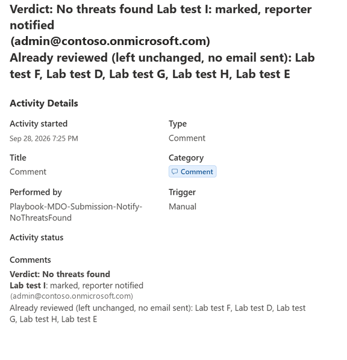</td>
</tr>
<tr>
<td>Posted automatically for every reported email, and again only when the verdict or Microsoft's analysis changes.</td>
<td>Lists the emails it marked, and the ones that were already reviewed and left unchanged.</td>
</tr>
</table>

<p align="center">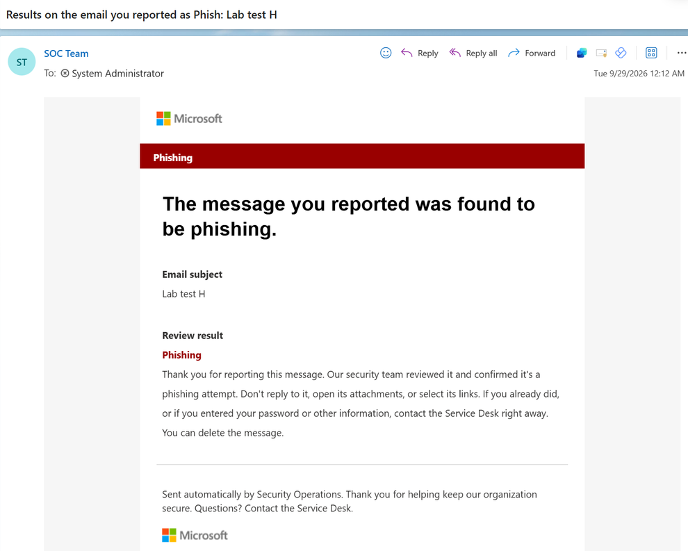<br><sub>The person who reported the email receives the result. Here the sender and text are customized (see <a href="#recommended-brand-the-result-email">Recommended: brand the result email</a>).</sub></p>

## The playbooks

| Playbook | What it does | How it runs |
|---|---|---|
| `MDO-Submission-Details` | Adds a **Reported email** comment for each reported email: the analyst verdict (for example *Not reviewed yet* or *Phishing (set by … on …)*), Microsoft's analysis, the sender, who reported it and when, and a working **Open in Submissions** link. It posts again only when the verdict or Microsoft's result changes. If the report details can't be read, it still posts a link for each reported email, built from its network message ID in the alert evidence. | Automatically, through two automation rules: when a reported-phish incident is created, and when a reported-phish alert is added to an existing incident. Analysts can also run it to refresh the status. |
| `MDO-Submission-Notify-Phishing` | Marks the incident's reported emails as **Phishing**. Microsoft emails the result to each person who reported one. | Analyst: incident → **…** → **Run playbook** |
| `MDO-Submission-Notify-NoThreatsFound` | Same, with **No threats found**. | Analyst: incident → **…** → **Run playbook** |
| `MDO-Submission-Notify-Spam` | Same, with **Spam**. | Analyst: incident → **…** → **Run playbook** |

The three Notify playbooks match the **Mark as and notify** choices on the Submissions page. Every playbook records what it did as a comment on the incident (**Activities** tab).

## How it works

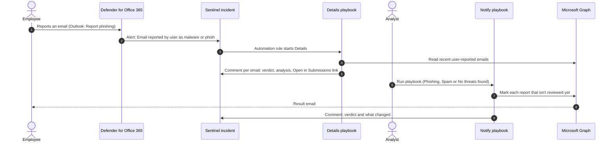

- **Finding the report.** Each *Email reported by user* alert ID ends with the same 17 characters as the ID of its submission. The playbooks read the last few days of user reports from Microsoft Graph and match on that suffix. If they can't find exactly one match, Details posts the **Open in Submissions** link instead, and the Notify playbooks change nothing and say so in their comment.
- **No duplicate comments or emails.** Details hides a short reference key, made of the submission ID, Microsoft's result and the verdict, in each comment's link. It compares the keys with the incident's existing comments and posts only what's new or changed. The Notify playbooks only mark emails that nobody has reviewed yet, so running one twice never sends a second email.
- **Safe to display.** Text that comes from the email itself, such as the subject and the sender, is HTML-escaped before it's written into a comment, so a crafted subject line can't plant a link in the incident.
- **Least privilege.** Each playbook has its own system-assigned managed identity. Details only reads reports (`ThreatSubmission.Read.All`). Only the Notify playbooks can mark them (`ThreatSubmission.ReadWrite.All`).

## Screenshots

These are from building and testing the playbooks in the Azure and Defender portals. Select a screenshot to open that step in the [step-by-step guide](docs/build-in-the-portal.md), which covers every step with screenshots.

<table>
<tr>
<td width="50%" valign="top"><a href="docs/build-in-the-portal.md#start-the-playbook-wizard">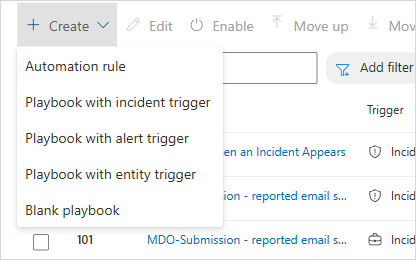</a><br><b>1. Create the playbook.</b> In the Defender portal: <b>Automation → Create → Playbook with incident trigger</b>.</td>
<td width="50%" valign="top"><a href="docs/build-in-the-portal.md#basics-and-connections">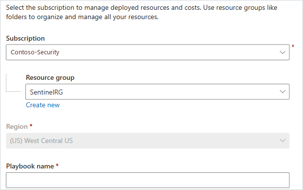</a><br><b>2. Name it.</b> The wizard turns on the playbook's managed identity and creates the Sentinel connection.</td>
</tr>
<tr>
<td width="50%" valign="top"><a href="docs/build-in-the-portal.md#2-list-user-reports">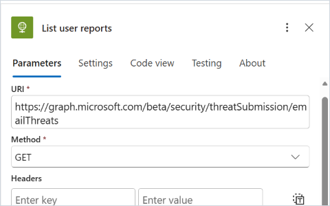</a><br><b>3. Read the user reports.</b> An HTTP action calls Microsoft Graph as the playbook's managed identity.</td>
<td width="50%" valign="top"><a href="docs/build-in-the-portal.md#6-matching-report">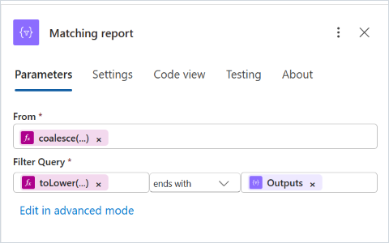</a><br><b>4. Find the report behind each alert.</b> Its ID ends with the same 17 characters as the alert ID.</td>
</tr>
<tr>
<td width="50%" valign="top"><a href="docs/build-in-the-portal.md#8-if-not-reviewed-yet">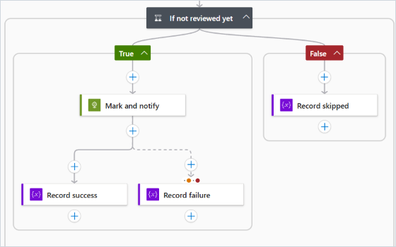</a><br><b>5. Skip emails that are already reviewed.</b> Nobody gets a second result email.</td>
<td width="50%" valign="top"><a href="docs/build-in-the-portal.md#9-mark-and-notify">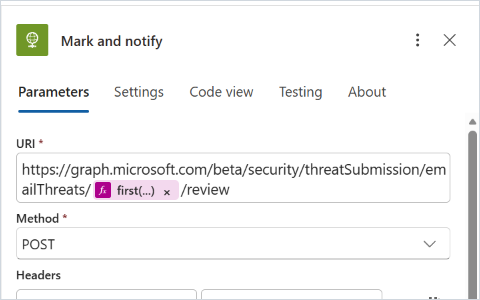</a><br><b>6. Mark and notify.</b> One Graph call sets the verdict, and Microsoft emails the result to the reporter.</td>
</tr>
<tr>
<td width="50%" valign="top"><a href="docs/build-in-the-portal.md#6l-add-status-comment">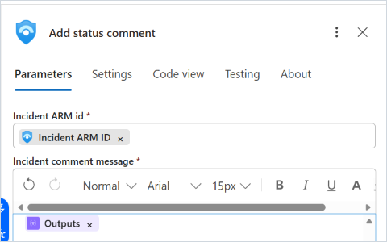</a><br><b>7. Post the status.</b> Details adds one comment per reported email.</td>
<td width="50%" valign="top"><a href="docs/build-in-the-portal.md#let-sentinel-run-playbooks-in-that-resource-group">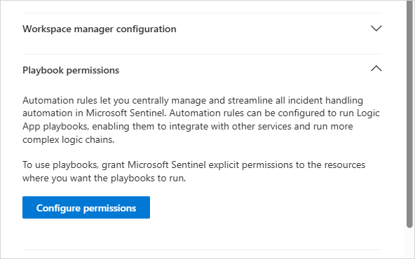</a><br><b>8. Let Sentinel start the playbooks.</b> <b>Playbook permissions</b> on their resource group.</td>
</tr>
<tr>
<td width="50%" valign="top"><a href="docs/build-in-the-portal.md#rule-1-a-new-reported-phish-incident">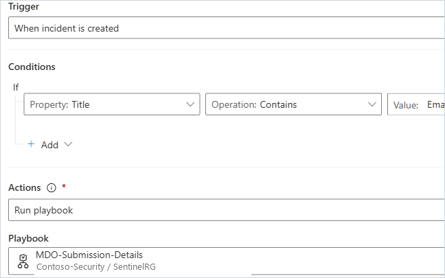</a><br><b>9. Run Details automatically.</b> An automation rule for each new reported-phish incident.</td>
<td width="50%" valign="top"><a href="docs/build-in-the-portal.md#save-permissions-test">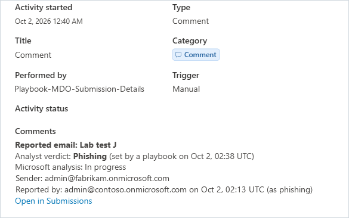</a><br><b>10. Check the result.</b> The status comment in the incident's <b>Activities</b>.</td>
</tr>
</table>

## Prerequisites

- **Microsoft Sentinel** with the **Microsoft Defender XDR** connector, so Defender incidents appear in Sentinel.
- **Run playbook** in the Defender portal needs Sentinel onboarded to the Defender portal. Otherwise, run the playbooks from Sentinel in the Azure portal.
- The person deploying needs:
  - **Owner**, or **Contributor** and **User Access Administrator**, on the playbook resource group and on the Sentinel workspace's resource group.
  - **Global Administrator** or **Privileged Role Administrator** in Microsoft Entra ID, to grant the Microsoft Graph permissions.
- **Azure Cloud Shell (PowerShell)** is the easiest place to run the script. It already has the Az module and Git.

## Deploy

### Option 1: PowerShell (recommended)

The script deploys everything, assigns the roles, creates the automation rules and grants the Microsoft Graph permissions. It takes 2–3 minutes and is safe to re-run.

```powershell
git clone https://github.com/Muatazawad2/Email.git
cd Email/MDO-Reported-Email-Playbooks

./deploy.ps1 -SubscriptionId <subscription-id> `
             -ResourceGroup <playbook-resource-group> `
             -WorkspaceName <sentinel-workspace-name> `
             -WorkspaceResourceGroup <workspace-resource-group>
```

| Parameter | Required | Description |
|---|---|---|
| `-SubscriptionId` | Yes | Subscription that holds the Sentinel workspace. |
| `-ResourceGroup` | Yes | Resource group for the playbooks. It's created in the workspace's region if it doesn't exist. |
| `-WorkspaceName` | Yes | Name of the Sentinel (Log Analytics) workspace. |
| `-WorkspaceResourceGroup` | No | The workspace's resource group. Defaults to `-ResourceGroup`. |
| `-Location` | No | Region for the playbooks. Defaults to the workspace's region. |
| `-PlaybookPrefix` | No | Name prefix for the playbooks. Defaults to `MDO-Submission`. |
| `-DisableAutomationRules` | No | Creates the two automation rules switched off. |
| `-SkipAutomationRules` | No | Doesn't create the automation rules. |
| `-SkipGraphPermission` | No | Doesn't grant the Microsoft Graph permissions. |

### Option 2: Deploy to Azure

You deploy twice: first the playbooks and their permissions, then the two automation rules. Microsoft Sentinel can only create the rules once its permission on the playbooks' resource group has taken effect.

1. Get the object ID of Microsoft Sentinel's service account, the **Azure Security Insights** enterprise application. In **Cloud Shell** (Bash or PowerShell), run:

   ```
   az ad sp show --id 98785600-1bb7-4fb9-b9fa-19afe2c8a360 --query id -o tsv
   ```

   Skip this if Sentinel already has permission on the resource group you'll use (Defender portal → **Settings → Microsoft Sentinel → SIEM workspaces** → the workspace → **Playbook permissions**).
2. Select **Deploy to Azure** at the top of this page and fill in:
   - **Resource group**: where the playbooks go. You can create a new one.
   - **Workspace Name** and **Workspace Resource Group**: your Sentinel workspace.
   - **Sentinel Service Principal Object Id**: the ID from step 1. Leave it empty if you skipped step 1.
   - **Deploy Automation Rules**: leave it set to `false`.

   Select **Review + create**, then **Create**.
3. Grant the Microsoft Graph permissions. Do this before the playbooks first run, because a playbook's access token can be cached for up to 24 hours. The portal has no screen for granting an app role to a managed identity, so run this in **Cloud Shell (PowerShell)** as a Global Administrator or Privileged Role Administrator. If you changed **Playbook Prefix**, change the four names to match.

   <details>
   <summary>Grant the Microsoft Graph permissions (PowerShell)</summary>

   ```powershell
   $resourceGroup = '<playbook-resource-group>'
   $grants = [ordered]@{
       'MDO-Submission-Details'               = 'ThreatSubmission.Read.All'
       'MDO-Submission-Notify-Phishing'       = 'ThreatSubmission.ReadWrite.All'
       'MDO-Submission-Notify-NoThreatsFound' = 'ThreatSubmission.ReadWrite.All'
       'MDO-Submission-Notify-Spam'           = 'ThreatSubmission.ReadWrite.All'
   }
   $t = Get-AzAccessToken -ResourceTypeName MSGraph
   $token = if ($t.Token -is [securestring]) { [System.Net.NetworkCredential]::new('', $t.Token).Password } else { $t.Token }
   $headers = @{ Authorization = "Bearer $token" }
   $graph = (Invoke-RestMethod -Headers $headers -Uri "https://graph.microsoft.com/v1.0/servicePrincipals?`$filter=appId eq '00000003-0000-0000-c000-000000000000'").value[0]
   foreach ($name in $grants.Keys) {
       $principalId = (Get-AzResource -ResourceGroupName $resourceGroup -ResourceType 'Microsoft.Logic/workflows' -Name $name).Identity.PrincipalId
       $role = $graph.appRoles | Where-Object { $_.value -eq $grants[$name] -and $_.allowedMemberTypes -contains 'Application' }
       $body = @{ principalId = $principalId; resourceId = $graph.id; appRoleId = $role.id } | ConvertTo-Json
       try {
           Invoke-RestMethod -Method Post -Headers $headers -ContentType 'application/json' -Body $body `
               -Uri "https://graph.microsoft.com/v1.0/servicePrincipals/$principalId/appRoleAssignments" | Out-Null
           Write-Host "Granted $($grants[$name]) to $name"
       } catch {
           if ("$($_.ErrorDetails.Message)" -match 'already exists') { Write-Host "Already granted: $name" } else { throw }
       }
   }
   ```

   </details>

4. Create the automation rules: deploy again with the same values and **Deploy Automation Rules** set to `true`. The quickest way is **Redeploy** on the first deployment (the resource group → **Deployments**). If it fails saying a playbook *is not using Microsoft Sentinel Incident trigger*, Sentinel's permission hasn't taken effect yet. Wait a few minutes and deploy again; redeploying is safe.

Running `deploy.ps1` with the same values does all four steps for you.

### Option 3: Build it by hand

To learn the Logic Apps designer, or if you can't deploy templates, follow the step-by-step guide with screenshots: [Build the playbooks in the Logic Apps designer](docs/build-in-the-portal.md).

## What gets created

| Where | What |
|---|---|
| Playbook resource group | 1 Microsoft Sentinel API connection (managed identity) and 4 Logic Apps (Consumption), each with its own system-assigned managed identity |
| Sentinel workspace | **Microsoft Sentinel Responder** for each playbook (read incidents, add comments), and 2 automation rules that run Details |
| Playbook resource group | **Microsoft Sentinel Automation Contributor** for the Sentinel service account, only if it's missing, so Sentinel can start the playbooks |
| Microsoft Entra ID | Microsoft Graph application permissions: `ThreatSubmission.Read.All` for Details, and `ThreatSubmission.ReadWrite.All` for the three Notify playbooks |

The two automation rules:

| Rule | Trigger | Conditions | Order |
|---|---|---|---|
| New reported-phish incident | When incident is created | **Title** contains `Email reported by user as malware or phish` | 100 |
| Reported-phish alert added | When incident is updated | **Alerts** added, and **Alert product names** contains **Microsoft Defender for Office 365** | 101 |

## Check that it works

1. Report a test email with Outlook's **Report → Report phishing**.
2. When the incident appears, usually within a few minutes, open **Activities**. A *Reported email: &lt;subject&gt;* comment shows *Analyst verdict: Not reviewed yet*, Microsoft's analysis, the sender, the reporter and an **Open in Submissions** link that opens exactly that report.
3. On the same incident, select **…** → **Run playbook** → **MDO-Submission-Notify-NoThreatsFound**. A *Verdict: No threats found* comment confirms the result. Within about two minutes, the reporter receives *Results on the email you reported*.
4. Run **MDO-Submission-Details** again. A new comment shows *Analyst verdict: No threats found (set by a playbook on …)*.

## Recommended: brand the result email

By default, the result email comes from `submissions@messaging.microsoft.com`, so Outlook flags it as external, and it only says *The message you reported was found to be …*. A security admin can change this once, in the Defender portal. The change applies to every result email, whether these playbooks send it or someone uses **Mark as and notify** on the Submissions page.

In the Defender portal, go to **Settings → Email & collaboration → User reported settings → Email notifications**:

1. Select **Customize results email**. On the **Phishing**, **Junk** and **No threats found** tabs, enter the text to show below the result, and a footer. For example (replace *the Service Desk* with how employees reach your help desk):

   | Tab | Email body results text |
   |---|---|
   | Phishing | Thank you for reporting this message. Our security team reviewed it and confirmed it's a phishing attempt. Don't reply to it, open its attachments, or select its links. If you already did, or if you entered your password or other information, contact the Service Desk right away. You can delete the message. |
   | Junk | Thank you for reporting this message. Our security team reviewed it and found it's junk email (unwanted or bulk mail), not phishing. You can delete it, or block the sender in Outlook to stop similar messages. |
   | No threats found | Thank you for reporting this message. Our security team reviewed it and found no threats, so no further action is needed. If it still seems suspicious, contact the Service Desk before you act on it. |

   Footer (the same on every tab): *Sent automatically by Security Operations. Thank you for helping keep our organization secure. Questions? Contact the Service Desk.*
2. Under **Customize sender and branding**:
   - Select **Specify a Microsoft 365 mailbox to use as the From address of email notifications**, and choose a mailbox your team monitors, such as the SOC shared mailbox. The email then comes from inside your organization, without the external-sender warning, and replies reach your team.
   - Optionally, select **Replace the Microsoft logo with my organization's logo across all reporting experiences**. Upload the logo first in the Microsoft 365 admin center (**Settings → Org settings → Organization profile → Custom themes**).
3. Select **Save**.

## Good to know

- **Beta API.** If the threat-submission API can't be read, Details still posts **Open in Submissions** links built from the alert evidence, and the Notify playbooks say so in a comment and change nothing.
- **How comments appear.** The **Activities** list shows the start of each comment, so it begins with the email subject and verdict. When you select a comment, the portal repeats its whole text as a large bold heading; a playbook can't change that style. The formatted version, with one detail per line and a clickable link, is under **Activity Details → Comments**. That's why Details posts one comment per reported email, to keep the heading short.
- **Verdict values.** The Notify playbooks send `phishing`, `spam` and `notJunk` (No threats found). The documented value `notSpam` is rejected by the service.
- **One verdict per run.** A Notify playbook applies its verdict to every reported email in the incident that hasn't been reviewed yet, and leaves reviewed ones unchanged. To give emails in the same incident different verdicts, open each one with **Open in Submissions** and use **Mark as and notify** there.
- **Who marked it.** **Marked by** in Submissions shows the playbook's identity, not the analyst's name. The incident's **Activities** tab shows which playbook ran.
- **Merged incidents.** Defender often adds new reports to an incident that already exists. The second automation rule handles that.
- **Link time window.** **Open in Submissions** links search two days on either side of when the email was reported.
- **ServiceNow and other ITSM tools.** If your integration syncs incident comments or work notes, the status and link appear in the ticket too.
- **Cost.** Logic Apps Consumption pricing: a fraction of a cent per run.

## Troubleshooting

| What you see | Likely cause and fix |
|---|---|
| The deployment fails with *Missing required permissions for Microsoft Sentinel on the playbook resource* | The automation rules were deployed before Sentinel had permission on the playbooks' resource group. Everything else was created. Set **Sentinel Service Principal Object Id** (see [Option 2](#option-2-deploy-to-azure)), wait a few minutes, and deploy again with **Deploy Automation Rules** set to `true`. |
| The deployment fails with *Playbook resource … is not using Microsoft Sentinel Incident trigger* | Sentinel's permission on the playbooks' resource group hasn't taken effect yet. The playbooks do use that trigger. Wait a few minutes and deploy again. |
| The deployment fails with *RoleAssignmentExists* | Sentinel already has permission on that resource group. Deploy again with **Sentinel Service Principal Object Id** left empty. |
| **List user reports** fails with 401 or 403 | The Microsoft Graph permission is missing or not active yet. Grant it (see [Deploy](#deploy)), then wait. A managed identity's token can be cached for up to 24 hours, so grant the permission before the first run where you can. |
| **Add comment** fails with *Forbidden* | The playbook's identity lacks **Microsoft Sentinel Responder** on the workspace. |
| The playbook isn't listed under **Run playbook** | It must use the Microsoft Sentinel incident trigger and be enabled, and Sentinel needs permission on its resource group: Defender portal → **Settings → Microsoft Sentinel → SIEM workspaces** → the workspace → **Playbook permissions**. |
| **Run playbook** shows *Failed to trigger playbook … status code 504* for every playbook | A temporary Microsoft Sentinel service issue. Nothing reaches the playbook. Try again later. |
| Runs fail with *connection not found* | The Microsoft Sentinel API connection was deleted. Deploy again: it recreates the connection and saves the playbooks against it. |
| Every email shows *already reviewed* | In a hand-built playbook, `null` in **If not reviewed yet** was typed as text. Enter it through **fx** (see the [designer guide](docs/build-in-the-portal.md)). |
| Each email gets two status comments | Two Details playbooks run from automation rules, or the loop's concurrency isn't set to 1. |
| The verdict request returns 400 | The verdict value isn't supported. Use `phishing`, `spam` or `notJunk`. |

Each run's inputs and outputs are in the Azure portal: the playbook → **Overview → Run history**.

## Remove

1. Delete the playbook resource group.
2. Delete the two automation rules: Microsoft Sentinel → **Automation**.
3. Remove the four **Microsoft Sentinel Responder** role assignments from the workspace.

## Repository layout

```text
MDO-Reported-Email-Playbooks/
├── README.md                    This page
├── azuredeploy.json             ARM template: API connection, playbooks, roles, automation rules
├── deploy.ps1                   One-command deployment, including the Microsoft Graph permissions
├── workflows/
│   ├── Details.workflow.json    Details playbook logic, for review
│   └── Notify.workflow.json     Notify playbook logic (shared by the three Notify playbooks), for review
└── docs/
    ├── build-in-the-portal.md   Step-by-step guide to building the playbooks in the designer
    └── images/                  Screenshots
```

Tested end to end in a lab tenant with Microsoft Defender XDR and Microsoft Sentinel in the Defender portal (September–October 2026). Screenshots come from that tenant; names such as *Contoso* and *Fabrikam* are placeholders.

## License

[MIT](../LICENSE). Provided as-is, without warranty or support. Review and test it in your environment before using it in production.
