# Build the playbooks in the Logic Apps designer

[← Back to the README](../README.md)

Build the four reported-email playbooks by hand in the Azure portal's Logic Apps designer. They're the same playbooks that [`azuredeploy.json`](../azuredeploy.json) deploys, so this guide is useful for learning the designer, or for when you can't deploy templates.

- Every expression below is copied from the tested workflow definitions in [`workflows/`](../workflows), so paste it rather than retyping it.
- Screenshots come from a test tenant. Names such as *Contoso* are placeholders.
- Allow about 90 minutes.

## Contents

1. [Start here](#start-here)
2. [Part 1 · Five designer skills](#part-1--five-designer-skills)
3. [Part 2 · Create the Notify-Phishing playbook](#part-2--create-the-notify-phishing-playbook)
4. [Part 3 · Build Notify-Phishing, step by step](#part-3--build-notify-phishing-step-by-step)
5. [Part 4 · Give the playbook its permissions](#part-4--give-the-playbook-its-permissions)
6. [Part 5 · Test it](#part-5--test-it)
7. [Part 6 · Clone for No threats found and Spam](#part-6--clone-for-no-threats-found-and-spam)
8. [Part 7 · Build Details](#part-7--build-details)
9. [Part 8 · Automation rules (run Details on its own)](#part-8--automation-rules-run-details-on-its-own)
10. [Troubleshooting](#troubleshooting)

## Start here

<p>You'll build the four reported-phish playbooks in the Azure portal's Logic Apps designer, by hand, the same ones <code>azuredeploy.json</code> deploys. Start with <b>Notify-Phishing</b>: it uses every designer skill you need. Clone it twice for <b>No threats found</b> and <b>Spam</b>, then build <b>Details</b> and its two automation rules.</p>
<div>
<div><h4>What you'll build</h4>
<table><tr><th>Playbook</th><th>Job</th></tr>
<tr><td>MDO-Submission-Notify-Phishing</td><td>Marks the incident's reported emails as Phishing; Microsoft emails each reporter.</td></tr>
<tr><td>MDO-Submission-Notify-NoThreatsFound</td><td>Clone of the above, verdict <i>No threats found</i>.</td></tr>
<tr><td>MDO-Submission-Notify-Spam</td><td>Clone of the above, verdict <i>Spam</i>.</td></tr>
<tr><td>MDO-Submission-Details</td><td>Posts one short status comment per reported email, with a working <b>Open in Submissions</b> link.</td></tr></table>
<p>Plus two automation rules that run Details on their own.</p></div>
<div><h4>Before you start</h4><ul>
<li><b>Microsoft Sentinel Contributor</b> (or higher) on the workspace, and <b>Logic App Contributor</b> on the resource group for the playbooks.</li>
<li><b>Owner</b> or <b>User Access Administrator</b> on the workspace, to give the playbooks their roles.</li>
<li><b>Global Administrator</b> or <b>Privileged Role Administrator</b> for one Cloud Shell step. It grants the Microsoft Graph permission, and the portal has no screen for that.</li>
<li>About 90 minutes.</li></ul></div></div>
<h4>The finished Notify playbook</h4>
<p>This is where Parts 2 and 3 end up. Come back to it whenever you're unsure where the next action goes.</p>

<p>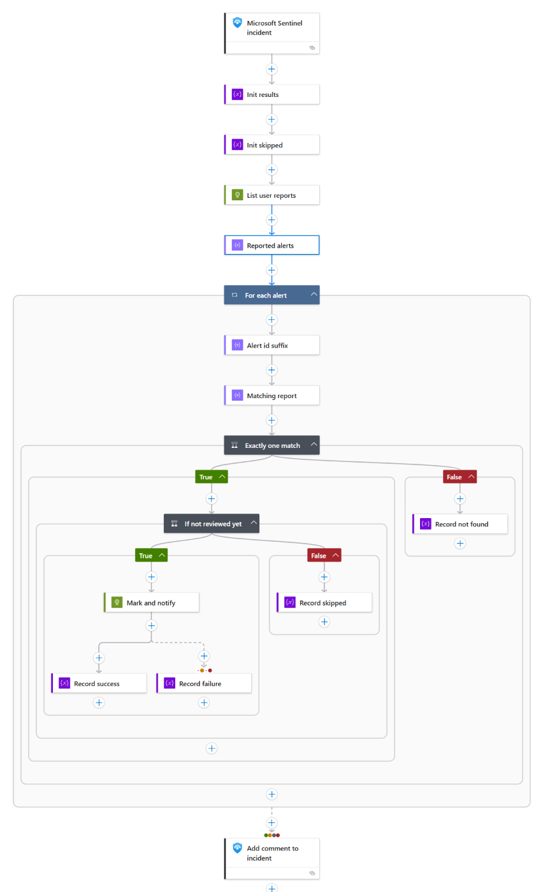<br><sub>The finished Notify-Phishing playbook in the designer (Expand all, then Zoom to fit)</sub></p>

## Part 1 · Five designer skills

### Add an action

<p>Select the <b>+</b> under the step you want to follow, then <b>Add an action</b>. Search by the action's name. The type to pick is shown in grey on every card in this guide.</p>

<table><tr><td valign="top" width="50%">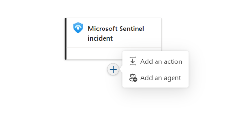<br><sub>The + menu under a step</sub></td><td valign="top" width="50%">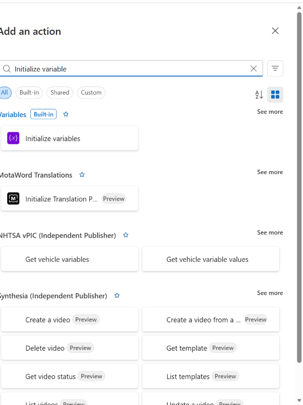<br><sub>Search, then select the action (here: Initialize variables)</sub></td></tr></table>

<p>To branch inside a Condition, use the <b>+</b> inside its <b>True</b> or <b>False</b> box. For a step that runs <i>next to</i> another, open the <b>+</b> under that step and choose <b>Add a parallel branch</b>.</p>

### Rename every action before you reference it

<p>Select the action's title at the top of its pane and type the name from this guide. <b>This matters:</b> expressions refer to actions by name, with spaces turned into underscores. <code>For each alert</code> becomes <code>For_each_alert</code>, and <code>Matching report</code> becomes <code>Matching_report</code>.</p>

> [!TIP]
> **Rule of thumb**<br>
> Rename first, then fill in the fields. If an expression names an action that doesn't exist (yet), the designer won't save.

### Dynamic content (lightning) vs. expression (fx)

<p>Click in any field. Two buttons appear on its left: <b>lightning</b> picks an output from an earlier step, and <b>fx</b> opens the expression editor.</p>

<table><tr><td valign="top" width="50%">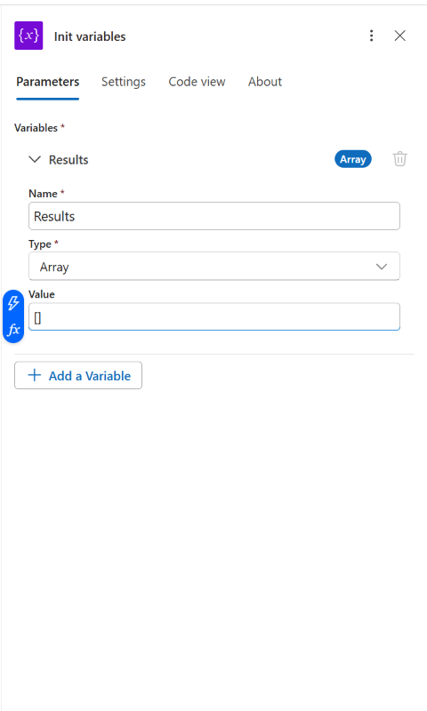<br><sub>Click a field: lightning (top) and fx (bottom) appear on its left</sub></td><td valign="top" width="50%">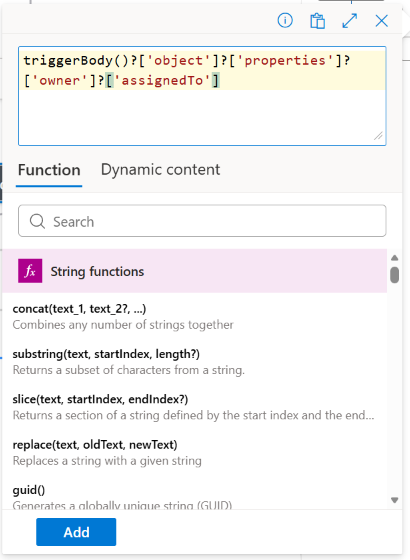<br><sub>fx: paste the expression, then select Add</sub></td></tr></table>

<ul><li>Paste the expressions from this guide into the fx box <b>without</b> a leading <code>@</code>, then select <b>Add</b>. The field shows a pink token such as <code>concat(...)</code>.</li>
<li>If the text shows as plain words instead of a token, it was typed into the field itself. Delete it and use fx.</li>
<li>Lightning is easier for simple picks such as <b>Incident ARM ID</b> or <b>Body</b> / <b>Outputs</b> of an earlier step.</li></ul>

<p>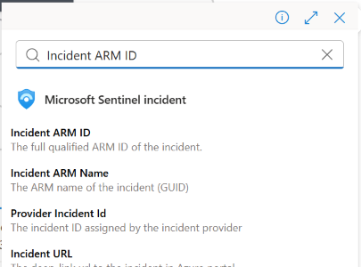<br><sub>Lightning → search → Incident ARM ID (from the Microsoft Sentinel incident trigger)</sub></p>

### The Settings tab: loops, paging and Run after

<p>Every action has a <b>Settings</b> tab. You'll use three settings:</p>
<ul><li><b>Concurrency control</b> (For each): turn <b>Limit</b> On and set <b>Degree of parallelism</b> to <b>1</b>, so emails are handled one at a time.</li>
<li><b>Pagination</b> (HTTP): On, threshold <b>5000</b>, so every report page is read.</li>
<li><b>Run after</b>: expand the earlier action and tick the outcomes this step should run on (<i>Is successful, Has timed out, Is skipped, Has failed</i>).</li></ul>

<table><tr><td valign="top" width="50%">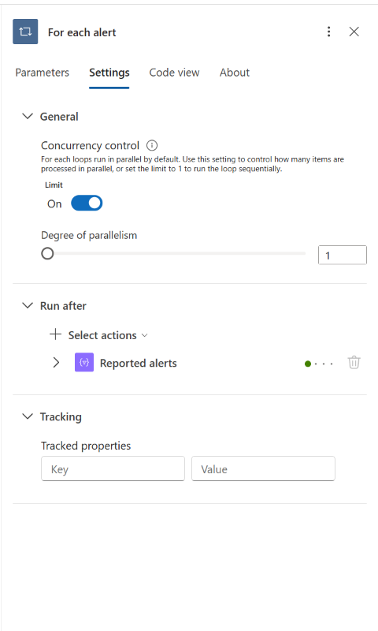<br><sub>For each → Settings: Concurrency 1, and Run after</sub></td><td valign="top" width="50%">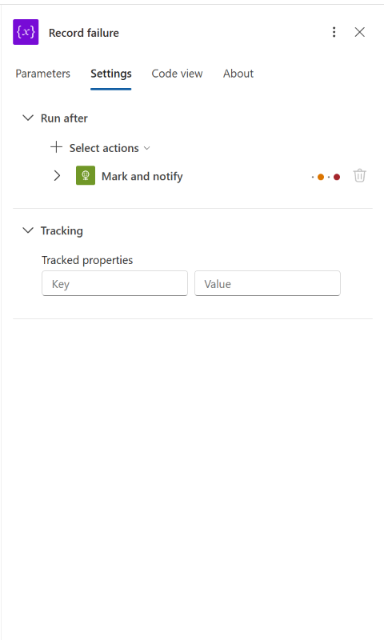<br><sub>Run after shown as coloured dots (here: Has timed out + Has failed)</sub></td></tr></table>

### Save, and check your work in Code view

<p>Select <b>Save</b> on the toolbar often, because the designer doesn't save on its own. Each action's <b>Code view</b> tab shows what you built as JSON. Compare it with <a href="../workflows/Notify.workflow.json"><code>workflows/Notify.workflow.json</code></a> or <a href="../workflows/Details.workflow.json"><code>Details.workflow.json</code></a>. The only intended difference: your comment messages sit inside <code>&lt;p class="editor-paragraph"&gt;</code>, which the comment box adds by itself.</p>

> [!NOTE]
> **If the designer asks to “Combine Initialize Variables”**<br>
> That prompt can appear when you open playbooks deployed from the template. Choose <b>No</b> while you're only looking, so nothing changes.

## Part 2 · Create the Notify-Phishing playbook

### Start the playbook wizard

<p>In the Defender portal: <b>Microsoft Sentinel → Configuration → Automation</b>, then <b>Create → Playbook with incident trigger</b>.</p>

<p>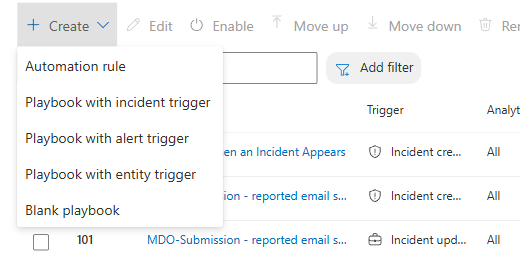<br><sub>Automation → Create → Playbook with incident trigger</sub></p>

### Basics and Connections

| Field | What to enter |
|---|---|
| **Subscription / Resource group** | Where the playbooks live (for example <code>rg-sentinel-playbooks</code>). The region follows the resource group. |
| **Playbook name** | <code>MDO-Submission-Notify-Phishing</code> |
| **Enable diagnostics logs** | Optional. Leave it off. |
| **Connections tab** | <b>Microsoft Sentinel · Connect with managed identity</b> is already chosen. Keep it. |

<table><tr><td valign="top" width="50%">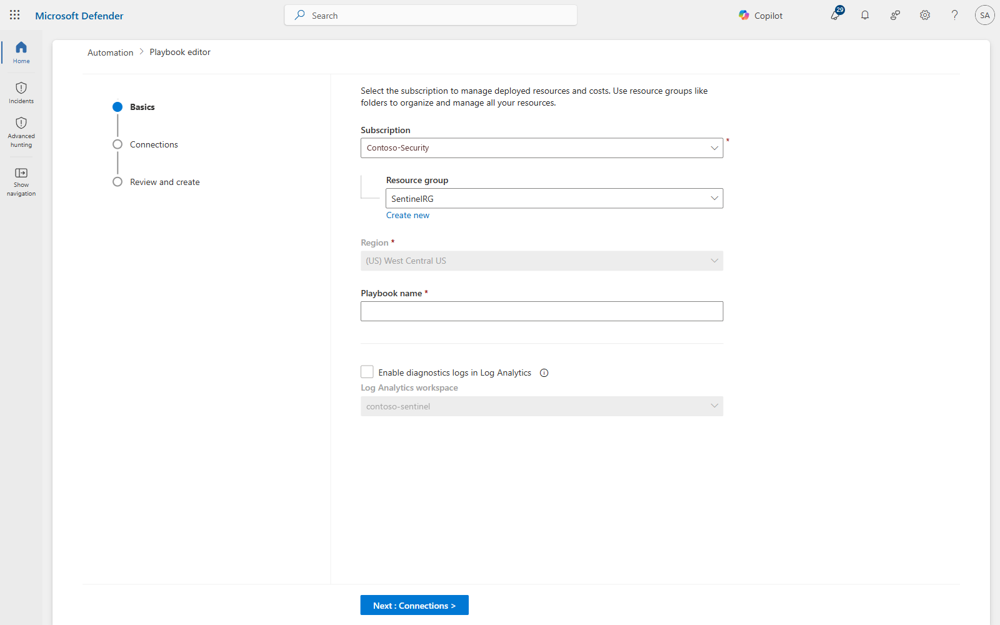<br><sub>Basics</sub></td><td valign="top" width="50%">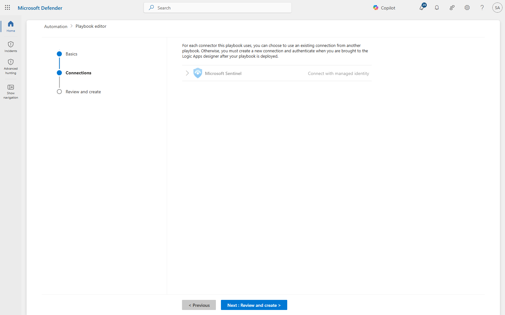<br><sub>Connections: Microsoft Sentinel with managed identity</sub></td></tr></table>

<p>Select <b>Next: Review and create</b>, then <b>Create playbook</b>. When it finishes, select <b>Close and go to playbook</b>. The wizard switches on the playbook's own identity (<i>system-assigned managed identity</i>), creates the Sentinel connection, and adds the trigger.</p>

### Look at what the wizard made

<p>The Azure portal opens the <b>Logic app designer</b> with one step: <b>Microsoft Sentinel incident</b>. That trigger hands the whole incident (its alerts, entities and comments) to the steps below it.</p>

<p>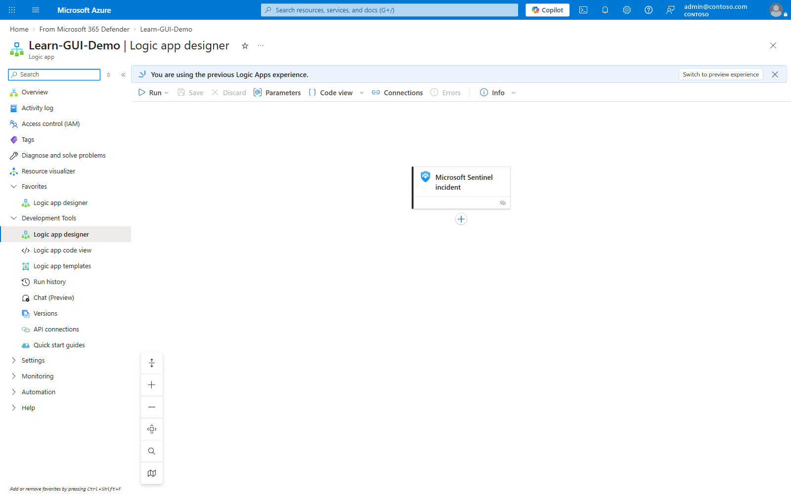<br><sub>A new playbook: just the Microsoft Sentinel incident trigger</sub></p>

> [!NOTE]
> **The banner “You are using the previous Logic Apps experience”**<br>
> This guide uses that default experience. Don't switch to the preview.

### Add two parameters

<p>Parameters hold the verdict, so the two clones only need new values instead of a rebuild. On the toolbar select <b>Parameters → Create parameter</b> twice:</p>

| Field | What to enter |
|---|---|
| **Name <code>ReviewCategory</code>** | Type <b>String</b>, Default value <code>phishing</code> |
| **Name <code>VerdictLabel</code>** | Type <b>String</b>, Default value <code>Phishing</code> |

<p>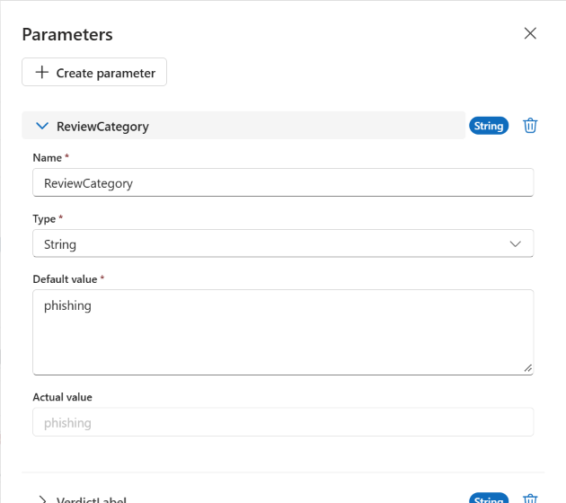<br><sub>Parameters pane</sub></p>

<p>Close the pane and <b>Save</b>.</p>

## Part 3 · Build Notify-Phishing, step by step

### 1. Init variables

**Type:** Initialize variables &nbsp;·&nbsp; **Where:** Under the trigger

<p>Two lists that fill up as the loop runs: <code>Results</code> for what changed, and <code>Skipped</code> for emails that were already reviewed.</p>

| Field | What to enter |
|---|---|
| **Variable 1** | Name <code>Results</code> · Type <b>Array</b> · Value <code>[]</code> |
| **Add a Variable → Variable 2** | Name <code>Skipped</code> · Type <b>Array</b> · Value <code>[]</code> |

### 2. List user reports

**Type:** HTTP &nbsp;·&nbsp; **Where:** Under Init variables

<p>Reads the last few days of user-reported emails from Microsoft Graph, using the playbook's own identity.</p>

| Field | What to enter |
|---|---|
| **URI** | <code>https://graph.microsoft.com/beta/security/threatSubmission/emailThreats</code> |
| **Method** | <b>GET</b> |
| **Queries** | Key <code>$filter</code> · Value: fx (below) |
| **Advanced parameters → Authentication** | Authentication type <b>Managed identity</b> · Managed identity <b>System-assigned managed identity</b> · Audience <code>https://graph.microsoft.com</code> |
| **Settings → Pagination** | <b>On</b>, Threshold <code>5000</code> |

**Queries → $filter value (fx)**

```
concat('source eq ''user'' and createdDateTime ge ', formatDateTime(addDays(coalesce(triggerBody()?['object']?['properties']?['createdTimeUtc'], utcNow()), -3), 'yyyy-MM-ddTHH:mm:ssZ'))
```

<table><tr><td valign="top" width="50%">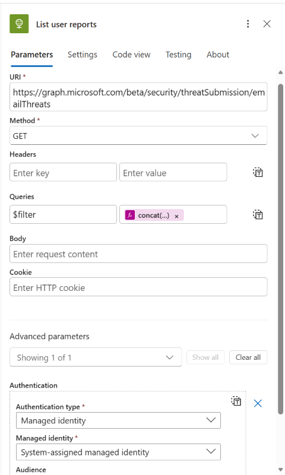<br><sub>Queries and Authentication</sub></td><td valign="top" width="50%">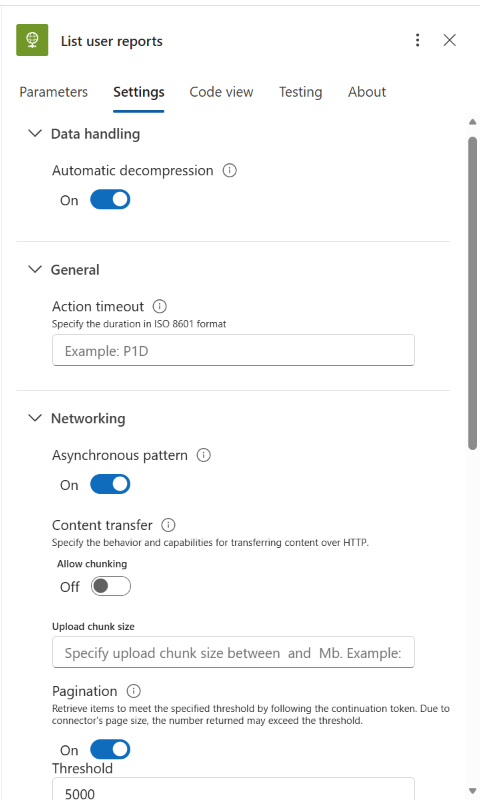<br><sub>Settings → Pagination On, 5000</sub></td></tr></table>

### 3. Reported alerts

**Type:** Filter array (Data Operations) &nbsp;·&nbsp; **Where:** Under List user reports

<p>Keeps only the incident's <i>Email reported by user as malware or phish</i> alerts.</p>

| Field | What to enter |
|---|---|
| **From** | fx (below) |
| **Filter Query** | Left: fx (below) · operator <b>contains</b> · right: type <code>reported by user</code> |

**From (fx)**

```
coalesce(triggerBody()?['object']?['properties']?['Alerts'], triggerBody()?['object']?['properties']?['alerts'], json('[]'))
```

**Filter Query, left value (fx)**

```
toLower(coalesce(item()?['properties']?['alertDisplayName'], ''))
```

<p>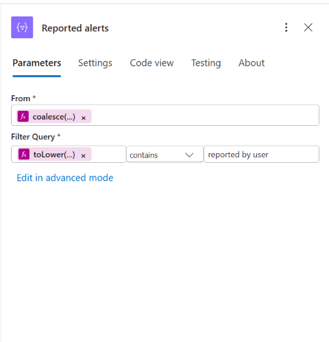<br><sub>Filter array in basic mode</sub></p>

### 4. For each alert

**Type:** For each (Control) &nbsp;·&nbsp; **Where:** Under Reported alerts

| Field | What to enter |
|---|---|
| **Select an output from previous steps** | Lightning → <b>Reported alerts</b> → <b>Body</b> |
| **Settings → Concurrency control** | Limit <b>On</b> · Degree of parallelism <b>1</b> |

<table><tr><td valign="top" width="50%">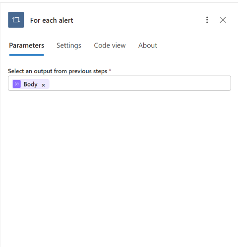<br><sub>Body of Reported alerts</sub></td><td valign="top" width="50%"><br><sub>Concurrency 1</sub></td></tr></table>

<p>The next steps all go <b>inside</b> this loop: use the <b>+</b> inside the For each box.</p>

### 5. Alert id suffix

**Type:** Compose (Data Operations) &nbsp;·&nbsp; **Where:** Inside For each alert

<p>An alert's ID ends with the same 17 characters as its report's ID. That's how the playbook finds the report behind each alert.</p>

| Field | What to enter |
|---|---|
| **Inputs** | fx (below) |

**Inputs (fx)**

```
toLower(substring(concat('00000000000000000', coalesce(items('For_each_alert')?['properties']?['providerAlertId'], '')), length(coalesce(items('For_each_alert')?['properties']?['providerAlertId'], '')), 17))
```

### 6. Matching report

**Type:** Filter array &nbsp;·&nbsp; **Where:** Under Alert id suffix

| Field | What to enter |
|---|---|
| **From** | fx (below) |
| **Filter Query** | Left: fx (below) · operator <b>ends with</b> · right: lightning → <b>Alert id suffix</b> → <b>Outputs</b> |

**From (fx)**

```
coalesce(body('List_user_reports')?['value'], json('[]'))
```

**Filter Query, left value (fx)**

```
toLower(coalesce(item()?['id'], ''))
```

<p>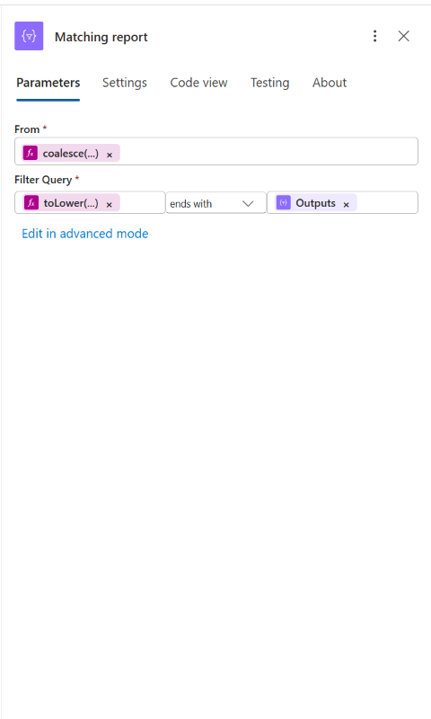<br><sub>ends with Outputs (of Alert id suffix)</sub></p>

### 7. Exactly one match

**Type:** Condition (Control) &nbsp;·&nbsp; **Where:** Under Matching report

| Field | What to enter |
|---|---|
| **Condition** | Left: fx (below) · <b>=</b> · right: type <code>1</code> |

**Left value (fx)**

```
length(body('Matching_report'))
```

<p>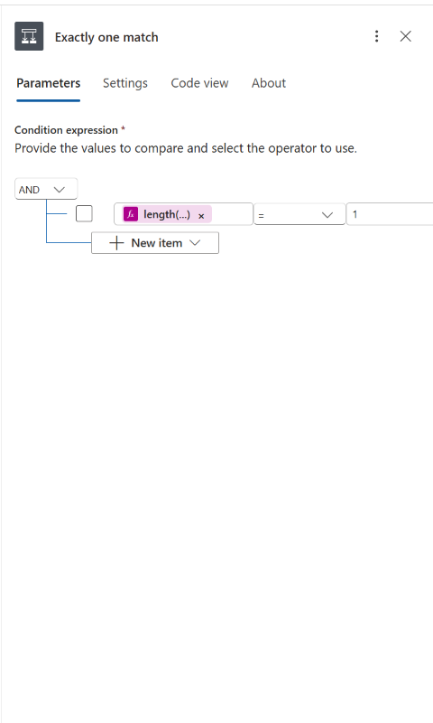<br><sub>length(...) = 1</sub></p>

### 8. If not reviewed yet

**Type:** Condition &nbsp;·&nbsp; **Where:** In the True box of Exactly one match

<p>Only emails that nobody has reviewed yet get a verdict, so a second run never sends a second email.</p>

| Field | What to enter |
|---|---|
| **Condition** | Left: fx (below) · <b>=</b> · right: <b>fx</b> → type <code>null</code> → Add |

**Left value (fx)**

```
first(body('Matching_report'))?['adminReview']
```

> [!WARNING]
> **Use fx for null**<br>
> If you type <code>null</code> straight into the box, it's saved as the word “null”, and every email looks reviewed. Through fx, Code view shows <code>"@null"</code>, which is correct.

<table><tr><td valign="top" width="50%">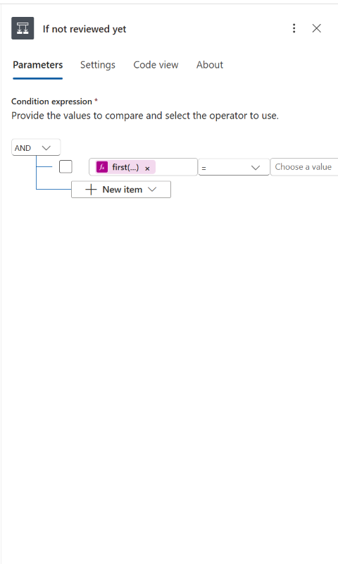<br><sub>The designer shows null as an empty box</sub></td><td valign="top" width="50%">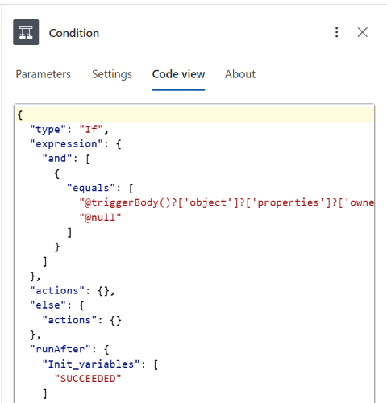<br><sub>Code view: "@null"</sub></td></tr></table>

### 9. Mark and notify

**Type:** HTTP &nbsp;·&nbsp; **Where:** In the True box of If not reviewed yet

<p>Marks the email with the verdict. Microsoft then emails the result to the person who reported it.</p>

| Field | What to enter |
|---|---|
| **URI** | Type <code>https://graph.microsoft.com/beta/security/threatSubmission/emailThreats/</code>, then fx <code>first(body('Matching_report'))?['id']</code>, then type <code>/review</code> |
| **Method** | <b>POST</b> |
| **Headers** | <code>Content-Type</code> = <code>application/json</code> |
| **Body** | Type <code>{{"category": "</code>, then fx <code>parameters('ReviewCategory')</code>, then type <code>"}}</code> |
| **Advanced parameters → Authentication** | Same as step 2: Managed identity, System-assigned, Audience <code>https://graph.microsoft.com</code> |

<p>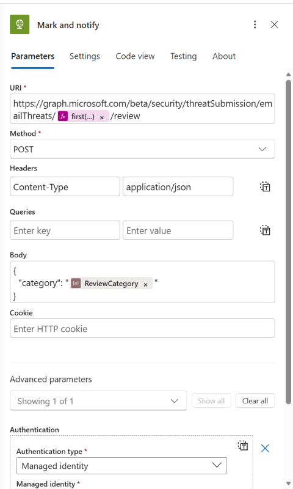<br><sub>URI with the report ID in the middle; body with the ReviewCategory parameter</sub></p>

### 10. Record success / Record failure

**Type:** Append to array variable &nbsp;·&nbsp; **Where:** Under Mark and notify: one normal step, one parallel branch

<p><b>Record success</b> (the <b>+</b> under Mark and notify → Add an action):</p>

| Field | What to enter |
|---|---|
| **Name** | <code>Results</code> |
| **Value** | fx (below) |

**Record success, Value (fx)**

```
concat('<b>', replace(replace(replace(coalesce(first(body('Matching_report'))?['subject'], '(no subject)'), '&', '&amp;'), '<', '&lt;'), '>', '&gt;'), '</b>: marked, reporter notified', if(empty(coalesce(first(body('Matching_report'))?['createdBy']?['email'], '')), '', concat(' (', coalesce(first(body('Matching_report'))?['createdBy']?['email'], ''), ')')))
```

<p><b>Record failure</b> (the <b>+</b> under Mark and notify → <b>Add a parallel branch</b>):</p>

| Field | What to enter |
|---|---|
| **Name** | <code>Results</code> |
| **Value** | fx (below) |
| **Settings → Run after** | Expand <b>Mark and notify</b>: clear <i>Is successful</i>, tick <b>Has failed</b> and <b>Has timed out</b> |

**Record failure, Value (fx)**

```
concat('<b>', replace(replace(replace(coalesce(first(body('Matching_report'))?['subject'], '(no subject)'), '&', '&amp;'), '<', '&lt;'), '>', '&gt;'), '</b>: not marked (HTTP ', string(outputs('Mark_and_notify')?['statusCode']), '). Try again, or use Open in Submissions.')
```

<table><tr><td valign="top" width="50%">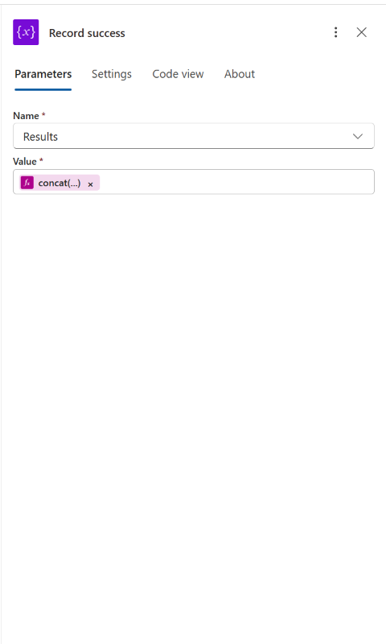<br><sub>Append to array variable</sub></td><td valign="top" width="50%"><br><sub>Record failure runs only if Mark and notify fails</sub></td></tr></table>

### 11. Record skipped

**Type:** Append to array variable &nbsp;·&nbsp; **Where:** In the False box of If not reviewed yet

| Field | What to enter |
|---|---|
| **Name** | <code>Skipped</code> |
| **Value** | fx (below): the subject, made safe to show as HTML |

**Value (fx)**

```
replace(replace(replace(coalesce(first(body('Matching_report'))?['subject'], '(no subject)'), '&', '&amp;'), '<', '&lt;'), '>', '&gt;')
```

### 12. Record not found

**Type:** Append to array variable &nbsp;·&nbsp; **Where:** In the False box of Exactly one match

| Field | What to enter |
|---|---|
| **Name** | <code>Results</code> |
| **Value** | fx (below) |

**Value (fx)**

```
concat('Alert ', coalesce(items('For_each_alert')?['properties']?['providerAlertId'], 'unknown'), ': no single matching report (', string(length(body('Matching_report'))), ' found). Use Open in Submissions.')
```

### 13. Add comment to incident

**Type:** Add comment to incident (V3) · Microsoft Sentinel &nbsp;·&nbsp; **Where:** Below the For each box (outside the loop)

| Field | What to enter |
|---|---|
| **Incident ARM id** | Lightning → <b>Incident ARM ID</b> |
| **Incident comment message** | fx (below). Leave the text formatting toolbar alone. |
| **Settings → Run after** | Expand <b>For each alert</b>: tick <b>all four</b> outcomes, so the comment is posted even if something failed |
| **Connection (bottom of the pane)** | Must say <i>Connected to Microsoft Sentinel (managed identity)</i>. If not, select <b>Change connection</b>. |

**Incident comment message (fx)**

```
if(not(equals(actions('List_user_reports')?['status'], 'Succeeded')), concat('<b>No action taken</b><br>The playbook could not read the reported emails (HTTP ', string(coalesce(outputs('List_user_reports')?['statusCode'], 'unknown')), '). Check its Microsoft Graph permission, or use Open in Submissions.'), if(greater(length(variables('Results')), 0), concat('<b>Verdict: ', parameters('VerdictLabel'), '</b><br>', join(variables('Results'), '<br>'), if(greater(length(variables('Skipped')), 0), concat('<br>', concat('Already reviewed (left unchanged, no email sent): ', join(variables('Skipped'), ', '))), '')), if(greater(length(variables('Skipped')), 0), concat('<b>Verdict: ', parameters('VerdictLabel'), ' (no change)</b><br>', concat('Already reviewed (left unchanged, no email sent): ', join(variables('Skipped'), ', '))), '<b>No action taken</b><br>This incident has no Email reported by user alerts.')))
```

> [!NOTE]
> **Why the expression has no outer &lt;p&gt;**<br>
> The comment box wraps whatever you insert in its own paragraph. This version leaves the paragraph tags out, so the finished comment looks exactly like the one the template deploys.

<table><tr><td valign="top" width="50%">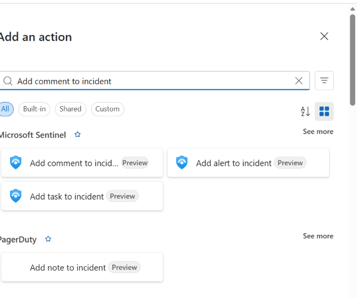<br><sub>Search: Add comment to incident (V3)</sub></td><td valign="top" width="50%">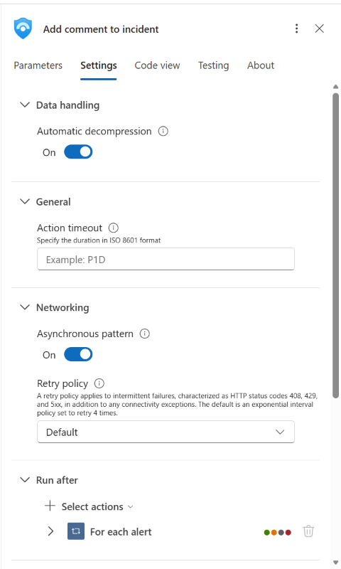<br><sub>Run after: all four outcomes of For each alert</sub></td></tr></table>

### Save and compare

<p>Select <b>Save</b>. Then use <b>Expand all</b> and <b>Zoom to fit</b> (the controls at the bottom left) and compare with the picture in <a href="#start-here">Start here</a>. If <b>Save</b> reports an error, open <b>Errors</b> on the toolbar. It's usually an action name that doesn't match an expression.</p>

## Part 4 · Give the playbook its permissions

### Microsoft Sentinel Responder on the workspace

<p>This lets the playbook read the incident and add comments. In the Azure portal, open the <b>Log Analytics workspace</b> for Sentinel → <b>Access control (IAM)</b> → <b>Add → Add role assignment</b>.</p>
<ol><li>Role: search <b>Microsoft Sentinel Responder</b>, select it, <b>Next</b>.</li>
<li>Assign access to: <b>Managed identity</b> → <b>Select members</b> → Managed identity: <b>Logic app</b> → pick the playbook (you can pick several) → <b>Select</b>.</li>
<li><b>Review + assign</b>.</li></ol>

<table><tr><td valign="top" width="50%">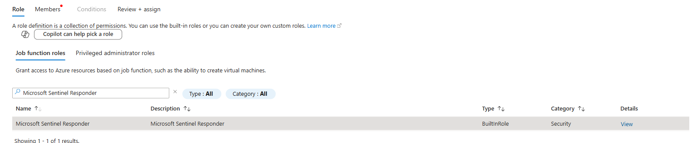<br><sub>Role: Microsoft Sentinel Responder (Job function roles)</sub></td><td valign="top" width="50%">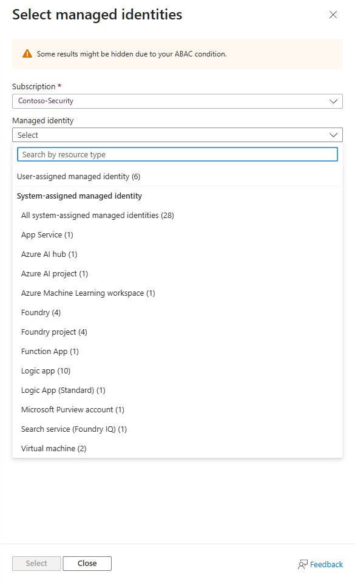<br><sub>Managed identity → Logic app</sub></td></tr></table>

### Microsoft Graph permission (Cloud Shell)

<p>The playbook reads and marks reported emails through Microsoft Graph, and the portal has no screen for granting an app permission to a managed identity. Open <b>Cloud Shell (PowerShell)</b> from the Azure portal's top bar, set <code>$resourceGroup</code>, keep only the playbooks you've built so far, and run:</p>

**PowerShell (Cloud Shell)**

```powershell
# Azure Cloud Shell (PowerShell). Run as Global Administrator or Privileged Role Administrator.
$resourceGroup = 'rg-sentinel-playbooks'     # the resource group that holds the playbooks
$grants = [ordered]@{
    'MDO-Submission-Details'               = 'ThreatSubmission.Read.All'
    'MDO-Submission-Notify-Phishing'       = 'ThreatSubmission.ReadWrite.All'
    'MDO-Submission-Notify-NoThreatsFound' = 'ThreatSubmission.ReadWrite.All'
    'MDO-Submission-Notify-Spam'           = 'ThreatSubmission.ReadWrite.All'
}
$t = Get-AzAccessToken -ResourceTypeName MSGraph
$token = if ($t.Token -is [securestring]) { [System.Net.NetworkCredential]::new('', $t.Token).Password } else { $t.Token }
$headers = @{ Authorization = "Bearer $token" }
$graph = (Invoke-RestMethod -Headers $headers -Uri "https://graph.microsoft.com/v1.0/servicePrincipals?`$filter=appId eq '00000003-0000-0000-c000-000000000000'").value[0]
foreach ($name in $grants.Keys) {
    $principalId = (Get-AzResource -ResourceGroupName $resourceGroup -ResourceType 'Microsoft.Logic/workflows' -Name $name).Identity.PrincipalId
    $role = $graph.appRoles | Where-Object { $_.value -eq $grants[$name] -and $_.allowedMemberTypes -contains 'Application' }
    $body = @{ principalId = $principalId; resourceId = $graph.id; appRoleId = $role.id } | ConvertTo-Json
    try {
        Invoke-RestMethod -Method Post -Headers $headers -ContentType 'application/json' -Body $body `
            -Uri "https://graph.microsoft.com/v1.0/servicePrincipals/$principalId/appRoleAssignments" | Out-Null
        Write-Host "Granted $($grants[$name]) to $name"
    } catch {
        if ("$($_.ErrorDetails.Message)" -match 'already exists') { Write-Host "Already granted: $name" } else { throw }
    }
}
```

<p>Details only reads, so it gets <code>ThreatSubmission.Read.All</code>. The Notify playbooks mark emails, so they get <code>ThreatSubmission.ReadWrite.All</code>. To check the result: Microsoft Entra admin center → <b>Enterprise applications</b> → filter <b>Managed Identities</b> → the playbook → <b>Permissions</b>. A new permission can take a few minutes to start working.</p>

### Let Sentinel run playbooks in that resource group

<p>Only needed once per resource group. It's what lets <b>Run playbook</b> and automation rules start your playbooks. In the Defender portal: <b>Settings → Microsoft Sentinel → SIEM workspaces</b> → select the workspace → <b>Playbook permissions → Configure permissions</b> → tick the playbooks' resource group → <b>Apply</b>.</p>

<p>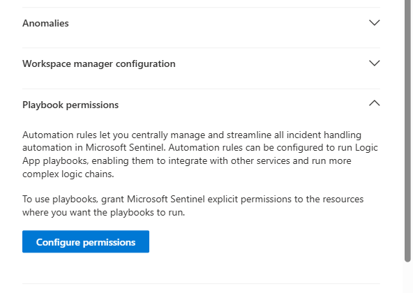<br><sub>Workspace settings → Playbook permissions</sub></p>

## Part 5 · Test it

### Create a test report

<p>In Outlook, open a test email and select <b>Report → Report phishing</b>. Within a few minutes, an incident with the alert <i>Email reported by user as malware or phish</i> appears. Defender may merge it into an existing incident.</p>

### Run the playbook on the incident

<p>Open the incident → <b>…</b> (top right) → <b>Run playbook</b> → find <b>MDO-Submission-Notify-Phishing</b> → <b>Run playbook</b>. The <b>Runs</b> tab in the same pane shows whether it started.</p>

<p>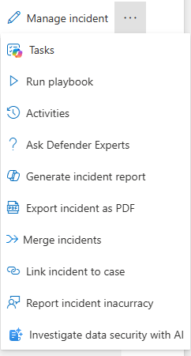<br><sub>The … menu at the top right of the incident → Run playbook</sub></p>

### Read the run history

<p>In the Azure portal: the playbook → <b>Overview → Run history</b> → select the run. Every step shows a green tick or a red cross. Select a step to see its exact inputs and outputs. This is how you debug any playbook.</p>

### Check the results

<p>In the incident's <b>Activities</b>, a comment starting <i>Verdict: Phishing</i> lists what changed. Within about two minutes, the reporter receives <i>Results on the email you reported</i>. Run the playbook again: the comment should now say <i>(no change)</i>, and no second email is sent.</p>

<p>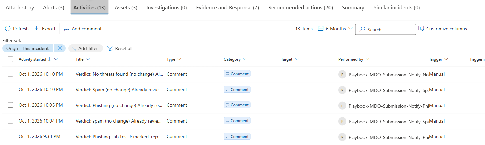<br><sub>The first run marks the email (bottom row). Later runs, from any Notify playbook, post “(no change)” because the email is already reviewed.</sub></p>

## Part 6 · Clone for No threats found and Spam

### Clone to Consumption

<p>Open <b>MDO-Submission-Notify-Phishing</b> in the Azure portal → <b>Overview</b> → the arrow next to <b>Clone to Standard</b> → <b>Clone to Consumption</b>. Name it <code>MDO-Submission-Notify-NoThreatsFound</code> → <b>Create</b>. Repeat for <code>MDO-Submission-Notify-Spam</code>.</p>

<table><tr><td valign="top" width="50%">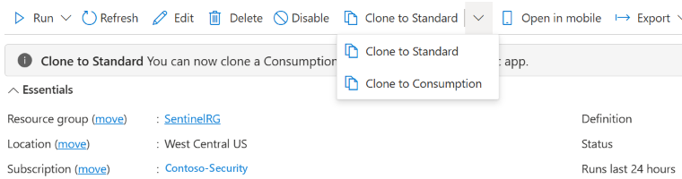<br><sub>Clone to Consumption</sub></td><td valign="top" width="50%">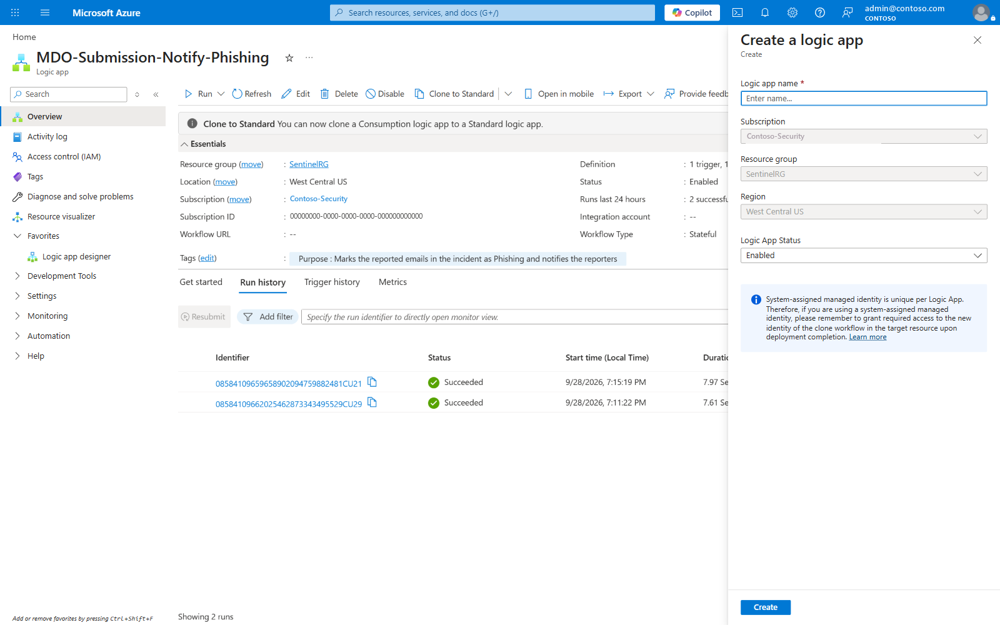<br><sub>The clone gets its own identity</sub></td></tr></table>

### Change the two parameters

<p>In each clone: <b>Logic app designer → Parameters</b>, then <b>Save</b>:</p>
<table><tr><th>Clone</th><th>ReviewCategory</th><th>VerdictLabel</th></tr>
<tr><td>Notify-NoThreatsFound</td><td><code>notJunk</code></td><td><code>No threats found</code></td></tr>
<tr><td>Notify-Spam</td><td><code>spam</code></td><td><code>Spam</code></td></tr></table>

> [!WARNING]
> **Use notJunk, not notSpam**<br>
> The Graph documentation lists <code>notSpam</code>, but the service rejects it. <code>notJunk</code> is what <b>No threats found</b> sends.

### Permissions for the clones

<p>A clone has its own identity, and nothing is copied over. Repeat <a href="#microsoft-sentinel-responder-on-the-workspace">Part 4 step 1</a> (Sentinel Responder) and <a href="#microsoft-graph-permission-cloud-shell">step 2</a> (Graph) for both clones.</p>

## Part 7 · Build Details

<p>Here's the logic you'll build, from top to bottom:</p>

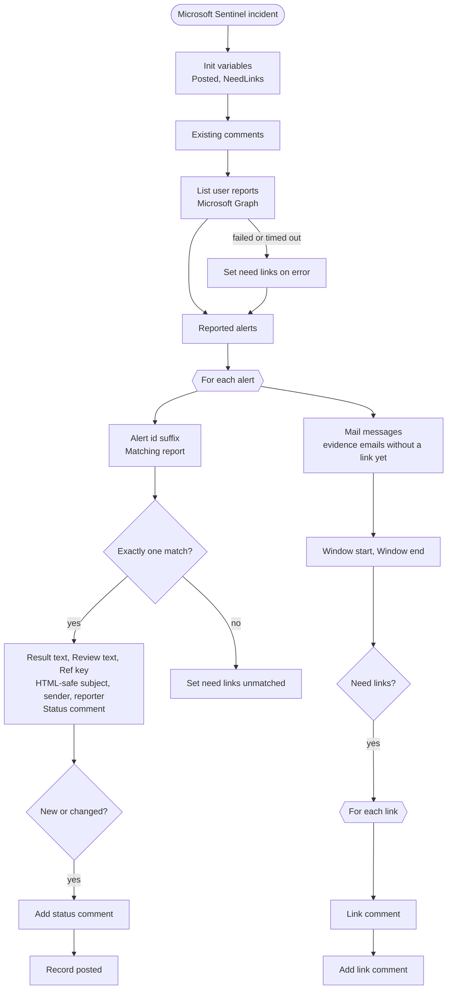
```mermaid
flowchart TD
    T([Microsoft Sentinel incident]) --> V[Init variables<br/>Posted, NeedLinks]
    V --> EC[Existing comments]
    EC --> L[List user reports<br/>Microsoft Graph]
    L -- failed or timed out --> E[Set need links on error]
    L --> RA[Reported alerts]
    E --> RA
    RA --> FE{{For each alert}}
    FE --> MR[Alert id suffix<br/>Matching report]
    MR --> ONE{Exactly one match?}
    ONE -- yes --> SC[Result text, Review text, Ref key<br/>HTML-safe subject, sender, reporter<br/>Status comment]
    SC --> NEW{New or changed?}
    NEW -- yes --> AC[Add status comment] --> RP[Record posted]
    ONE -- no --> NL[Set need links unmatched]
    FE --> MM[Mail messages<br/>evidence emails without a link yet]
    MM --> W[Window start, Window end]
    W --> NEED{Need links?}
    NEED -- yes --> FL{{For each link}} --> LC[Link comment] --> AL[Add link comment]
```

### Create the Details playbook

<p>Repeat <a href="#start-the-playbook-wizard">Part 2 steps 1–3</a> with the name <code>MDO-Submission-Details</code>. It needs no parameters. Then add the actions below in order. The first ones are the same as in Notify.</p>
<p>Details runs the same steps as the template version, in a simpler order that's easier to build by hand. The template version starts some steps side by side, and its fallback links use a <i>Select</i> step instead of a loop.</p>

### 1. Init variables

**Type:** Initialize variables &nbsp;·&nbsp; **Where:** Under the trigger

| Field | What to enter |
|---|---|
| **Variable 1** | <code>Posted</code> · <b>Array</b> · <code>[]</code>  (emails already commented in this run) |
| **Variable 2** | <code>NeedLinks</code> · <b>Boolean</b> · <code>false</code>  (post fallback links?) |

<p>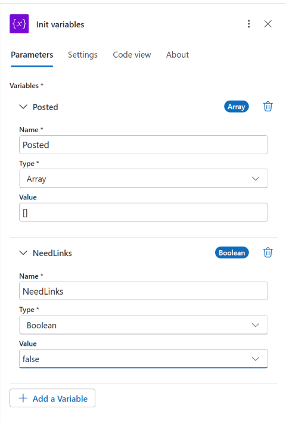<br><sub>Init variables: Posted (Array, []) and NeedLinks (Boolean, false)</sub></p>

### 2. Existing comments

**Type:** Compose &nbsp;·&nbsp; **Where:** Under Init variables

<p>The incident's existing comments as text, so an email's status is only posted again when it changes.</p>

**Inputs (fx)**

```
string(coalesce(triggerBody()?['object']?['properties']?['comments'], json('[]')))
```

### 3. List user reports

**Type:** HTTP &nbsp;·&nbsp; **Where:** Under Existing comments

<p>Exactly as in <a href="#2-list-user-reports">Notify step 2</a>: same URI, $filter, managed identity and Pagination.</p>

### 4. Set need links on error

**Type:** Set variable &nbsp;·&nbsp; **Where:** Under List user reports

| Field | What to enter |
|---|---|
| **Name / Value** | <code>NeedLinks</code> · fx <code>true</code> |
| **Settings → Run after** | List user reports: only <b>Has failed</b> and <b>Has timed out</b> |

<p>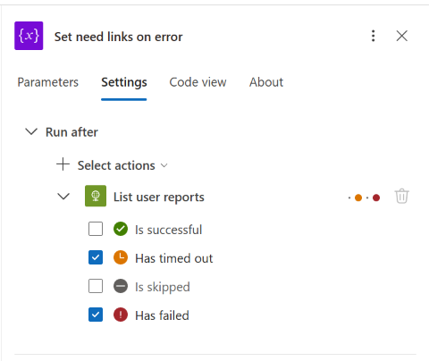<br><sub>Run after: only Has timed out and Has failed of List user reports</sub></p>

### 5. Reported alerts

**Type:** Filter array &nbsp;·&nbsp; **Where:** Under Set need links on error

<p>Same fields as <a href="#3-reported-alerts">Notify step 3</a>, plus:</p>

| Field | What to enter |
|---|---|
| **Settings → Run after** | Set need links on error: <b>Is successful</b> and <b>Is skipped</b>, so it runs whether or not Graph worked |

<p>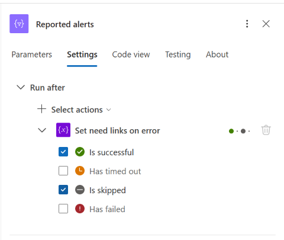<br><sub>Run after: Is successful and Is skipped of Set need links on error</sub></p>

### 6. For each alert

**Type:** For each &nbsp;·&nbsp; **Where:** Under Reported alerts

| Field | What to enter |
|---|---|
| **Output** | Body of Reported alerts |
| **Settings** | Concurrency Limit On, Degree of parallelism 1 |

### 6a. Alert id suffix

**Type:** Compose &nbsp;·&nbsp; **Where:** Inside the loop

<p>Same as <a href="#5-alert-id-suffix">Notify step 5</a>.</p>

### 6b. Matching report

**Type:** Filter array &nbsp;·&nbsp; **Where:** Under Alert id suffix

<p>Same as <a href="#6-matching-report">Notify step 6</a>.</p>

### 6c. Exactly one match

**Type:** Condition &nbsp;·&nbsp; **Where:** Under Matching report

<p>Same as <a href="#7-exactly-one-match">Notify step 7</a>. Build 6d–6m in its <b>True</b> box and 6n in its <b>False</b> box.</p>

### 6d. Result text

**Type:** Compose &nbsp;·&nbsp; **Where:** True box

<p>Microsoft's analysis in plain words.</p>

**Inputs (fx)**

```
coalesce(json('{"beingAnalyzed":"In progress","notJunk":"No threats found","noThreatsFound":"No threats found","phishing":"Phishing","spam":"Spam","malware":"Malware","threatsFound":"Threats found","phishingSimulation":"Phishing simulation","allowedByPolicy":"Allowed by policy","blockedByPolicy":"Blocked by policy","spoof":"Spoof","noResultAvailable":"No result available","notSubmittedToMicrosoft":"Not submitted to Microsoft","unknown":"Unknown"}')?[coalesce(first(body('Matching_report'))?['result']?['category'], 'none')], first(body('Matching_report'))?['result']?['category'], 'Not available')
```

### 6e. Review text

**Type:** Compose &nbsp;·&nbsp; **Where:** Under Result text

<p>The analyst verdict and who set it.</p>

**Inputs (fx)**

```
if(equals(first(body('Matching_report'))?['adminReview'], null), '<b>Not reviewed yet</b>', concat('<b>', coalesce(json('{"notJunk":"No threats found","phishing":"Phishing","spam":"Spam","malware":"Malware"}')?[coalesce(first(body('Matching_report'))?['adminReview']?['reviewResult'], 'none')], first(body('Matching_report'))?['adminReview']?['reviewResult'], '?'), '</b> (set by ', if(contains(coalesce(first(body('Matching_report'))?['adminReview']?['reviewBy'], ''), '@'), first(body('Matching_report'))?['adminReview']?['reviewBy'], 'a playbook'), if(empty(coalesce(first(body('Matching_report'))?['adminReview']?['reviewDateTime'], '')), '', concat(' on ', formatDateTime(first(body('Matching_report'))?['adminReview']?['reviewDateTime'], 'MMM d, HH:mm'), ' UTC')), ')'))
```

### 6f. Ref key

**Type:** Compose &nbsp;·&nbsp; **Where:** Under Review text

<p>A fingerprint of the email's current status. It's hidden in the comment's link and used to spot changes.</p>

**Inputs (fx)**

```
concat('mdo-rd-', first(body('Matching_report'))?['id'], '-', coalesce(first(body('Matching_report'))?['result']?['category'], 'none'), '-', coalesce(first(body('Matching_report'))?['adminReview']?['reviewResult'], 'unreviewed'), '.')
```

### 6g. Subject html

**Type:** Compose &nbsp;·&nbsp; **Where:** Under Ref key

<p>Makes the subject safe to show, so a phishing subject can't plant a fake link in your comment.</p>

**Inputs (fx)**

```
replace(replace(replace(coalesce(first(body('Matching_report'))?['subject'], '(no subject)'), '&', '&amp;'), '<', '&lt;'), '>', '&gt;')
```

### 6h. Sender html

**Type:** Compose &nbsp;·&nbsp; **Where:** Under Subject html

**Inputs (fx)**

```
replace(replace(replace(coalesce(first(body('Matching_report'))?['sender'], 'unknown'), '&', '&amp;'), '<', '&lt;'), '>', '&gt;')
```

### 6i. Reporter html

**Type:** Compose &nbsp;·&nbsp; **Where:** Under Sender html

**Inputs (fx)**

```
replace(replace(replace(coalesce(first(body('Matching_report'))?['createdBy']?['email'], 'unknown'), '&', '&amp;'), '<', '&lt;'), '>', '&gt;')
```

### 6j. Status comment

**Type:** Compose &nbsp;·&nbsp; **Where:** Under Reporter html

<p>The comment text: verdict, Microsoft analysis, sender, reporter and the link.</p>

**Inputs (fx)**

```
concat('<b>Reported email: ', outputs('Subject_html'), '</b><br>', 'Analyst verdict: ', outputs('Review_text'), '<br>', 'Microsoft analysis: ', outputs('Result_text'), '<br>', 'Sender: ', outputs('Sender_html'), '<br>', 'Reported by: ', outputs('Reporter_html'), ' on ', formatDateTime(first(body('Matching_report'))?['createdDateTime'], 'MMM d, HH:mm'), ' UTC (as ', if(equals(first(body('Matching_report'))?['category'], 'spam'), 'junk', if(equals(first(body('Matching_report'))?['category'], 'notJunk'), 'not junk', coalesce(first(body('Matching_report'))?['category'], 'unknown'))), if(equals(first(body('Matching_report'))?['attackSimulationInfo'], null), '', '; attack simulation'), ')<br>', '<a href="', concat('https://security.microsoft.com/reportsubmission?viewid=user&userSubmissionFilter=', encodeUriComponent(concat('{"Id":["', first(body('Matching_report'))?['id'], '"],"Date":["', formatDateTime(addDays(first(body('Matching_report'))?['createdDateTime'], -2), 'yyyy-MM-ddTHH:mm:ss.fffZ'), '","', formatDateTime(addDays(first(body('Matching_report'))?['createdDateTime'], 2), 'yyyy-MM-ddTHH:mm:ss.fffZ'), '"]}')), '&mdoref=', outputs('Ref_key')), '">Open in Submissions</a>')
```

### 6k. If new or changed

**Type:** Condition &nbsp;·&nbsp; **Where:** Under Status comment

| Field | What to enter |
|---|---|
| **Row 1** | fx <code>outputs('Existing_comments')</code> · <b>not contains</b> · fx <code>outputs('Ref_key')</code> |
| **New item → Add row: row 2** | fx <code>variables('Posted')</code> · <b>not contains</b> · fx <code>outputs('Ref_key')</code> |
| **Group** | Leave <b>AND</b> |

<table><tr><td valign="top" width="50%">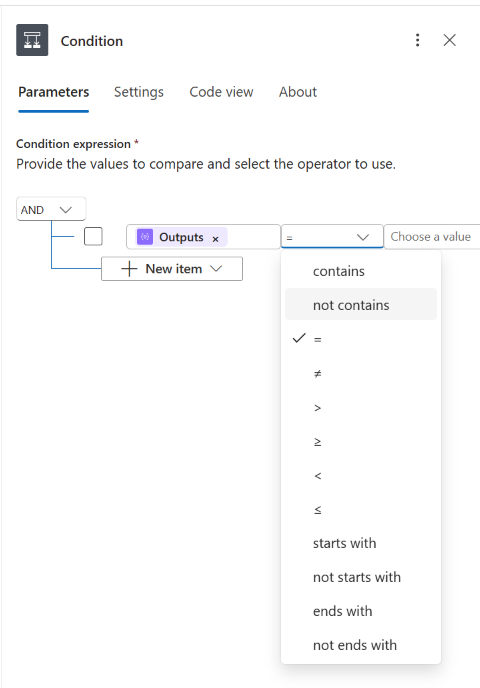<br><sub>The operator list: pick not contains</sub></td><td valign="top" width="50%">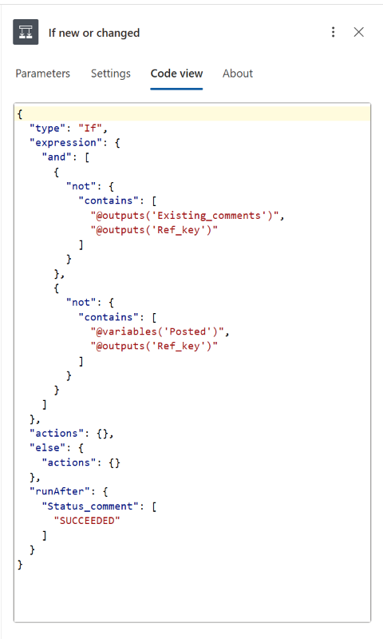<br><sub>Code view: two not contains checks joined by and</sub></td></tr></table>

<p>Build 6l and 6m in its <b>True</b> box.</p>

### 6l. Add status comment

**Type:** Add comment to incident (V3) &nbsp;·&nbsp; **Where:** True box of If new or changed

| Field | What to enter |
|---|---|
| **Incident ARM id** | Lightning → Incident ARM ID |
| **Incident comment message** | Lightning → <b>Status comment</b> → <b>Outputs</b> |

<p>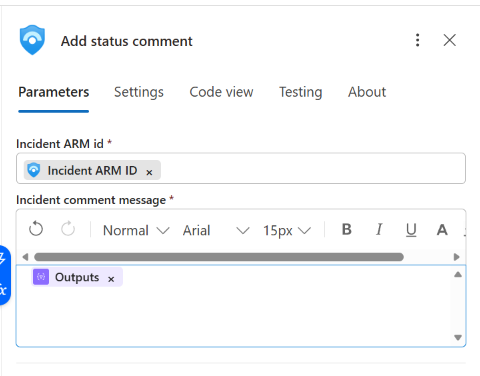<br><sub>Incident ARM ID from the trigger, and the Outputs of Status comment as the message</sub></p>

### 6m. Record posted

**Type:** Append to array variable &nbsp;·&nbsp; **Where:** Under Add status comment

| Field | What to enter |
|---|---|
| **Name / Value** | <code>Posted</code> · fx <code>outputs('Ref_key')</code> |

### 6n. Set need links unmatched

**Type:** Set variable &nbsp;·&nbsp; **Where:** False box of Exactly one match

| Field | What to enter |
|---|---|
| **Name / Value** | <code>NeedLinks</code> · fx <code>true</code> |

### 7. Mail messages

**Type:** Filter array &nbsp;·&nbsp; **Where:** Below the For each box

<p>The reported emails in the incident's evidence that don't have a link yet. Used only when the details can't be read.</p>

| Field | What to enter |
|---|---|
| **From** | fx (below) |
| **Filter Query** | Left: fx (below) · <b>=</b> · right: fx <code>true</code> |
| **Settings → Run after** | For each alert: <b>all four</b> outcomes |

**From (fx)**

```
coalesce(triggerBody()?['object']?['properties']?['relatedEntities'], json('[]'))
```

**Filter Query, left value (fx)**

```
and(equals(item()?['kind'], 'MailMessage'), not(startsWith(coalesce(item()?['properties']?['subject'], ''), 'Phishing:')), not(startsWith(coalesce(item()?['properties']?['subject'], ''), 'Junk:')), not(startsWith(coalesce(item()?['properties']?['subject'], ''), 'Not junk:')), not(contains(string(coalesce(triggerBody()?['object']?['properties']?['comments'], json('[]'))), coalesce(item()?['properties']?['networkMessageId'], '#none#'))))
```

<table><tr><td valign="top" width="50%">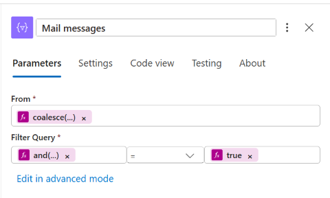<br><sub>From and Filter Query, all through fx</sub></td><td valign="top" width="50%">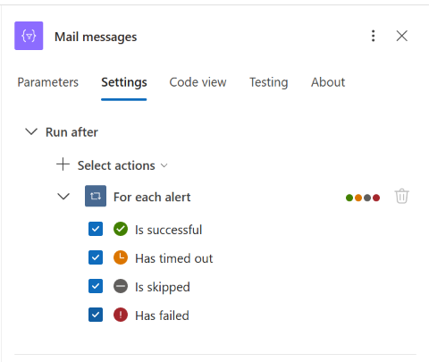<br><sub>Run after: all four outcomes of For each alert</sub></td></tr></table>

### 8. Window start

**Type:** Compose &nbsp;·&nbsp; **Where:** Under Mail messages

**Inputs (fx)**

```
formatDateTime(addDays(coalesce(triggerBody()?['object']?['properties']?['createdTimeUtc'], utcNow()), -2), 'yyyy-MM-ddTHH:mm:ss.fffZ')
```

### 9. Window end

**Type:** Compose &nbsp;·&nbsp; **Where:** Under Window start

**Inputs (fx)**

```
formatDateTime(addDays(coalesce(triggerBody()?['object']?['properties']?['createdTimeUtc'], utcNow()), 2), 'yyyy-MM-ddTHH:mm:ss.fffZ')
```

### 10. If need links

**Type:** Condition &nbsp;·&nbsp; **Where:** Under Window end

| Field | What to enter |
|---|---|
| **Row 1** | fx <code>length(body('Reported_alerts'))</code> · <b>&gt;</b> · <code>0</code> |
| **Row 2** | fx <code>variables('NeedLinks')</code> · <b>=</b> · fx <code>true</code> |
| **Row 3** | fx <code>length(body('Mail_messages'))</code> · <b>&gt;</b> · <code>0</code> |

<p>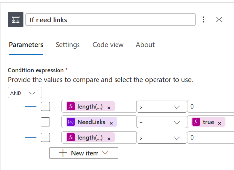<br><sub>Three rows joined by AND</sub></p>

<p>Build 11–13 in its <b>True</b> box.</p>

### 11. For each link

**Type:** For each &nbsp;·&nbsp; **Where:** True box of If need links

| Field | What to enter |
|---|---|
| **Output** | Lightning → Mail messages → <b>Body</b> |
| **Settings** | Concurrency Limit On, Degree of parallelism 1 |

<table><tr><td valign="top" width="50%">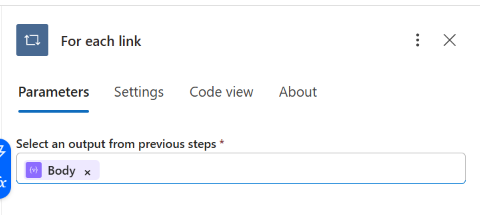<br><sub>Output: Body of Mail messages</sub></td><td valign="top" width="50%">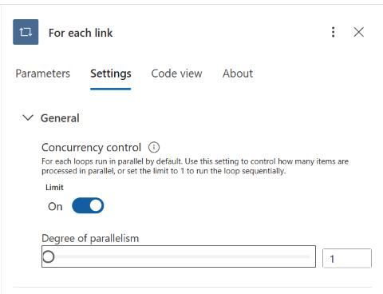<br><sub>Settings → Concurrency control: Limit On, Degree of parallelism 1</sub></td></tr></table>

### 12. Link comment

**Type:** Compose &nbsp;·&nbsp; **Where:** Inside For each link

**Inputs (fx)**

```
concat('<b>Reported email: ', replace(replace(replace(coalesce(item()?['properties']?['subject'], '(no subject)'), '&', '&amp;'), '<', '&lt;'), '>', '&gt;'), '</b><br>Received by: ', replace(replace(replace(coalesce(item()?['properties']?['recipient'], 'unknown'), '&', '&amp;'), '<', '&lt;'), '>', '&gt;'), '<br>Details are not available right now.<br><a href="', concat('https://security.microsoft.com/reportsubmission?viewid=user&userSubmissionFilter=', encodeUriComponent(concat('{"ObjectId":["', item()?['properties']?['networkMessageId'], '"],"Date":["', outputs('Window_start'), '","', outputs('Window_end'), '"]}'))), '">Open in Submissions</a>')
```

### 13. Add link comment

**Type:** Add comment to incident (V3) &nbsp;·&nbsp; **Where:** Under Link comment

| Field | What to enter |
|---|---|
| **Incident ARM id** | Lightning → Incident ARM ID |
| **Incident comment message** | Lightning → <b>Link comment</b> → <b>Outputs</b> |

### Save, permissions, test

<p><b>Save</b>, then give Details the <b>Microsoft Sentinel Responder</b> role and <code>ThreatSubmission.Read.All</code> (<a href="#part-4--give-the-playbook-its-permissions">Part 4</a>). Test it with <b>Run playbook</b> on a reported-phish incident. You should see one <i>Reported email: &lt;subject&gt;</i> comment per email. Run it again and nothing new is posted until a verdict changes.</p>

<p>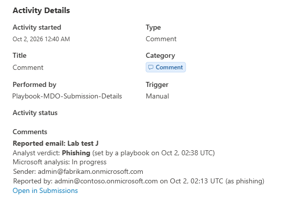<br><sub>A Reported email comment from the hand-built Details playbook, in the incident's Activities</sub></p>

## Part 8 · Automation rules (run Details on its own)

### Rule 1: a new reported-phish incident

<p>Defender portal → <b>Microsoft Sentinel → Configuration → Automation → Create → Automation rule</b>.</p>

| Field | What to enter |
|---|---|
| **Automation rule name** | <code>MDO-Submission - reported email status (new reported-phish incident)</code> |
| **Trigger** | <b>When incident is created</b> |
| **Conditions** | Property <b>Title</b> · <b>Contains</b> · <code>Email reported by user as malware or phish</code> |
| **Actions** | <b>Run playbook</b> → <b>MDO-Submission-Details</b> |
| **Order** | <code>100</code> |

<p>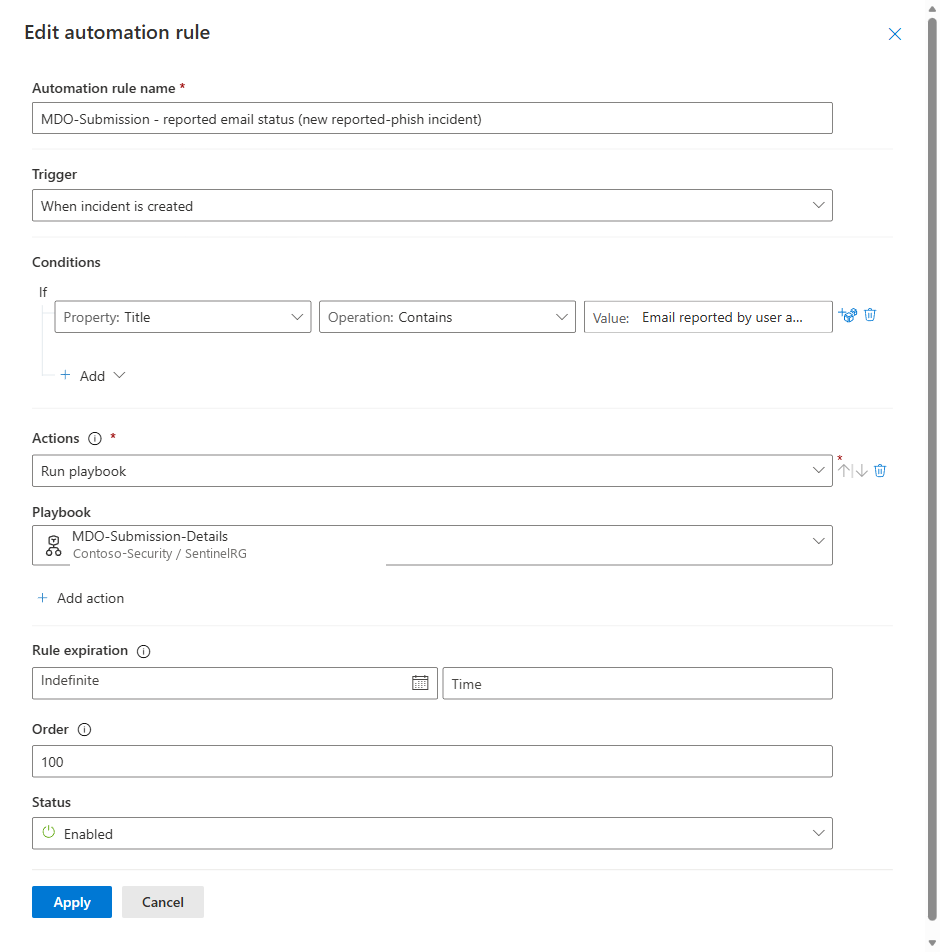<br><sub>Rule 1</sub></p>

### Rule 2: a reported-phish alert joins an existing incident

| Field | What to enter |
|---|---|
| **Automation rule name** | <code>MDO-Submission - reported email status (reported-phish alert added)</code> |
| **Trigger** | <b>When incident is updated</b> |
| **Condition 1** | Property <b>Alerts</b> · <b>Added</b> |
| **Condition 2 (AND)** | Property <b>Alert product names</b> · <b>Contains</b> · <b>Microsoft Defender for Office 365</b> |
| **Actions** | <b>Run playbook</b> → <b>MDO-Submission-Details</b> |
| **Order** | <code>101</code> |

<p>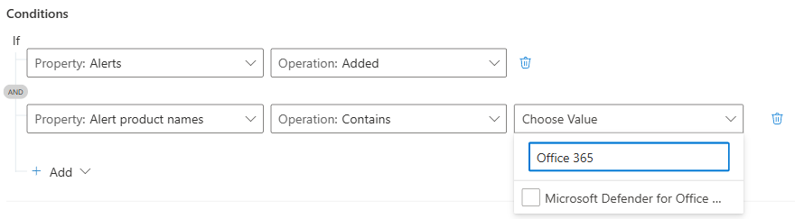<br><sub>Condition 2: Choose Value → search Office 365 → tick Microsoft Defender for Office 365</sub></p>

<p>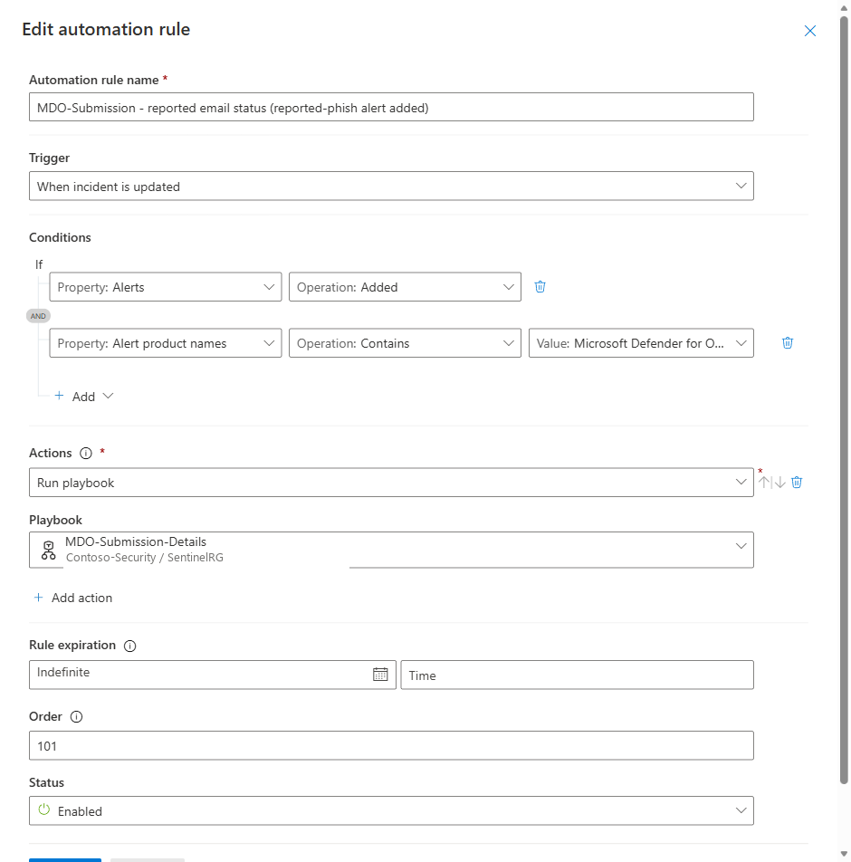<br><sub>Rule 2</sub></p>

<p>Defender often adds new reports to an incident that already exists. Rule 2 catches those.</p>

## Troubleshooting

<table><thead><tr><th>What you see</th><th>Likely cause and fix</th></tr></thead><tbody>
<tr><td><b>Save</b> fails and names an action that isn't defined</td><td>An expression refers to an action by a different name. Check the spelling, and remember spaces become underscores.</td></tr>
<tr><td>A field shows the expression as plain text, or the comment contains <code>concat(</code></td><td>It was typed into the field instead of fx. Delete it and add it through fx.</td></tr>
<tr><td><b>List user reports</b> fails with 401 or 403</td><td>The Graph permission is missing or not active yet (Part 4 step 2). Wait a few minutes and run again.</td></tr>
<tr><td><b>Add comment</b> fails with Forbidden</td><td>The playbook's identity lacks <b>Microsoft Sentinel Responder</b> on the workspace (Part 4 step 1).</td></tr>
<tr><td>The playbook isn't listed under <b>Run playbook</b></td><td>It must use the Microsoft Sentinel incident trigger and be Enabled, and Sentinel needs Playbook permissions on its resource group (Part 4 step 3).</td></tr>
<tr><td>Every email shows “already marked”</td><td>The right side of <b>If not reviewed yet</b> was typed as text. Re-enter <code>null</code> through fx.</td></tr>
<tr><td>Duplicate comments</td><td>For each concurrency isn't set to 1, or two Details playbooks (for example, one from the template and one built by hand) both run from automation rules.</td></tr>
<tr><td>Verdict API returns 400</td><td>ReviewCategory has an unsupported value. Use <code>phishing</code>, <code>spam</code> or <code>notJunk</code>.</td></tr>
</tbody></table>

---

**Developer**: Dr. Muataz Awad
